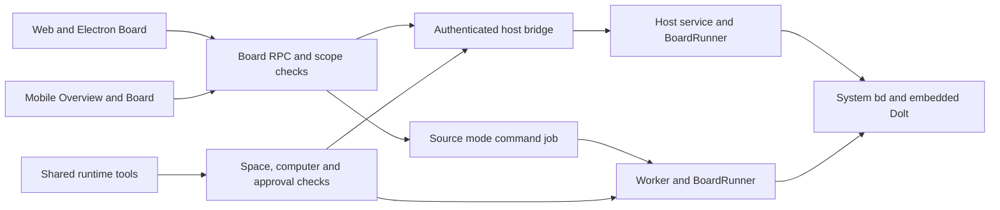

# Board

Board lets an operator create dependent work, find work that can start, assign it
to a bot, and review the result. Builders can keep that work in an existing
folder board. Researchers can read the dependency graph and export JSONL. Team
leads can group children under epics. Local-first users keep issue data in the
owner's installed Beads database.

## Provider and execution

`ProjectBoardProvider` lives in `packages/adapter-kit/src/board.ts`. Adapter-kit
already defines several provider boundaries; it is not limited to sandboxes.
`WorkItem`, RPC schemas and bridge payloads live in
`packages/contracts/src/board.ts`. `BeadsBoardProvider` implements the interface
in `packages/adapters/src/board/beads.ts`.



Packaged operation uses `board.run` on the existing authenticated host bridge.
The host runs the installed `bd` found on its login PATH. Human source-mode
requests use a `board.run` background job so execution happens in the worker;
`board_commands` is a transient request/result table with deadlines. Its queued
to running transition prevents a job retry from replaying a mutation. A crash
after a mutation but before its response requires checking the board before
retrying; it cannot be made transactional with the application database.

The runner uses `execFile` with an argv array and `shell: false`. It accepts a
complete allowlist of command grammars, resolves a registered folder root,
rejects database redirects and escaping metadata paths, and serializes reads
and writes by real workspace path. The command deadline includes queue wait.
External lock conflicts return `Another write is in progress`. No board command
installs software or invokes a shell.

The owner and space membership are checked before every call. Bots additionally
must belong to the space and reach the owner's computer. Actor names come from
the account display name or `bot:<bot name>`, never Git configuration. Remote
read-only grants allow workspace, snapshot and item reads and reject mutations.

## Workspaces and initialization

The space board is initialized explicitly in Settings → Customize → Boards at
`<app home>/board/<space id>/.beads/`. The space-id segment is intentional: using
one `<app home>/board/.beads/` for every space would share unrelated work. Prefixes
are derived from the space name. `board_workspaces` records kind, path, prefix,
enabled state and ownership. Existing folder prefixes are read from Beads.

Registered folders appear in the picker. A folder whose `.beads/` directory
contains `metadata.json` or `config.yaml` is opened directly. A `.beads/`
directory that has `beads.db` or `embeddeddolt/` but neither settings file is
not a board: discovery reports it as not initialized, and Start board refuses
with "This folder has board data without its settings files. Move its .beads
folder aside, then start the board." Nothing is deleted. An empty registered
folder requires the owner to choose `Start board`; a dialog lists the files
before initialization.
The exact initialization flags tested against `bd version 1.2.2 (6c124203e)` are:

```text
bd --json --actor <display name> --sandbox --dolt-auto-commit off init --non-interactive --skip-agents --skip-hooks --stealth --prefix <prefix>
```

Initialization sets the confined working directory through `execFile`, because
1.2.2 rejects `-C` for an uninitialized folder. Later calls use `-C <root>`.
`--skip-agents` also skips agent integrations. `--skip-hooks` skips hooks.
`--stealth` avoids the initialization Git commit. Git discovery is disabled for
the child process as well, so stealth mode does not edit `.git/info/exclude`.
These flags were checked with `bd init --help` and the
[1.2.2 initialization source](https://github.com/gastownhall/beads/blob/v1.2.2/cmd/bd/init.go).

The verified initialization writes these entries, all inside `.beads/`:

- `config.yaml`, `metadata.json`, `.gitignore`, `README.md`
- `interactions.jsonl`, `.local_version`, `embeddeddolt/` and its database files

New boards also run `config set types.custom spike,story,milestone`. Existing
boards keep their configuration. Priorities are P0–P4. The interface offers the
six built-in issue types plus those three custom types. If an existing board
does not configure a custom type, Beads remains authoritative and rejects it.

Child-only environment settings disable metrics, event flushing, hooks, shared
server selection, remote operations and Git identity discovery. The runner
removes inherited `BD_*`, `BEADS_*`, `GIT_*` and `DOLT_*` overrides before setting
`BEADS_DIR`, `BD_DB`, `BD_DOLT_SHARED_SERVER=false`, `BD_NO_HOOKS=true`,
`BD_DISABLE_METRICS=1`, `BD_DISABLE_EVENT_FLUSH=1`, `BEADS_NO_GIT_OPS=true`,
`BEADS_DOLT_LOCAL_ONLY=true`, `GIT_DIR=<null device>`,
`GIT_CONFIG_GLOBAL=<null device>` and `GIT_CONFIG_NOSYSTEM=1`.
`bd metrics off` exists but changes global preferences, so this feature uses the
per-process opt-out supported by the
[metrics source](https://github.com/gastownhall/beads/blob/v1.2.2/internal/metrics/metrics.go)
and [configuration source](https://github.com/gastownhall/beads/blob/v1.2.2/internal/config/config.go).

The tested embedded workspace works without a separate `dolt` executable on
PATH. Discovery reports whether it is installed, and command failures identify
a missing Dolt executable if the installed Beads build requires one. Server-mode,
redirected, symlinked and escaping databases are outside this implementation's
scope. The supported version gate is 1.2.x.

When `bd` is missing, the page shows `Beads is not installed on this computer`
and links to the [official installation instructions](https://github.com/gastownhall/beads/blob/v1.2.2/README.md#installation),
including `brew install beads` and `npm install -g @beads/bd`. Installation is a
human action.

## Board and bot behavior

The top bar contains Dashboard, Bots and IDE, with Cmd/Ctrl+1, 2 and 3. Dashboard
contains Overview and Board views. `/app/board` selects Board; `workspace` and
`item` query parameters preserve board and item deep links. The active view uses
`Board — Ardur Bot` as the window title. Overview's Work panel shows the default
board's Ready, In progress and Blocked counts and its next three ready items.

Board shows Ready, In progress, Blocked, Deferred and Done. Done contains
items closed during the last seven days. Ready and Blocked use Beads results;
the application does not infer readiness from a cached dependency list. Pinned
items appear in Deferred and hooked items in In progress. Search, type, label,
assignee and epic filters narrow the board. The dependency view uses inline SVG;
the epic view shows child completion counts.

Columns virtualize long lists. Dragging a card changes its status immediately;
a refused Beads command restores the prior card. The drawer's status selector
provides the keyboard alternative, and Undo performs another authorized update.
Each column has quick-add. Filters for text, label, assignee and bot are local to
the device. The whole view uses one non-overlapping, foreground summary poll at
15 seconds, including at most one selected item. There are no per-item or per-bot
subscriptions. Work uses the Dashboard's bounded panel polling.

The item drawer shows description, acceptance criteria, Blocks, Blocked by,
comments and available history. New-item and edit forms keep parent, dependencies,
labels, assignee, due date and defer date behind More. Export writes JSONL under
`<app home>/board-exports/<space id>/` and displays the path. JSONL is interchange,
not a full Dolt backup.

`board_ready`, `board_show`, `board_create`, `board_update`, `board_claim`,
`board_close`, `board_comment` and `board_link` use the shared tool registry for
all supported runtimes, including Pi, Claude Code and Codex. Reads are read-only;
writes go through the existing low-risk action approval rules. Webhook authority
does not bypass approvals. There is no delete tool.

Settings → Customize → Boards includes "Bots keep the board and memory current".
It is on by default. While it is on, a bot that can reach an enabled board receives
those tools and a short instruction: claim or link the item this run serves, file
unfinished work after checking for an open item with the same title, comment
outcomes, close finished items with a reason, and record durable learnings with
`remember`. If there is no board, the computer is unreachable, or the run is
read-only, the instruction says so in one sentence and only tools that can run are
offered. If the default board does not admit the bot but another initialized board
does, the tools stay and the instruction adds `Pass workspaceId <id>.` Turning the
setting off removes that instruction, the filing caps, the duplicate-title check
and the `bot-filed` label. The same row shows whether learning review is on, the
reviewer model, and Enable. Enable uses the existing learning configure call. Learning review stays
off until someone turns it on.

Bot-created items keep the actor `bot:<name>`, the label `bot-filed`, and the run
id in Beads metadata while the setting is on. The run, bot and filer are written in
one Beads update; if the same run finds its own item without them, it writes them
again. The server allows 5 new items per run and 30 per space each hour, and returns
an existing open item when the normalized title matches. Filings in one space run one
at a time under a Postgres session advisory lock; the reservation is its own short
transaction and no Beads command runs inside a database transaction. A filing that
waits 15 seconds for the lock returns `Another write is in progress`. A failed create
that left no item removes its reservation. It redacts that run's secrets from titles,
descriptions, acceptance criteria, labels, assignees, external references, comments
and close reasons whether or not the setting is on. Read-only
grants still reject writes. A stale phone confirmation does not make the board
read-only; the run pauses for confirmation the same way as other consequential tools.

The Work panel and mobile Overview group the last 30 days of filing records by bot
and show completed, open and otherwise-closed counts. A board read observes returned
closed items and records the first outcome without another Beads call. An empty close
reason or a completion word (done, complete, fixed, resolved) is completed unless a
negation comes up to three words before it ("not done", "can't get it fixed"); every
other reason, including "won't fix", is closed otherwise. A learning proposal that
links to an existing item records its outcome but is not counted again. An item
that nobody reads after it closes remains open in this projection until the next read,
so staleness is unbounded for an abandoned board and otherwise lasts until the next
15-second foreground board poll or later board access.

Send to a bot creates a normal conversation turn containing the item's title,
description and acceptance criteria. The item becomes in progress, assigned to
`bot:<bot name>`. Its workspace and item ID are saved on the run before enqueue.
Duplicate dispatches use the normal conversation nonce. Active runs prevent
sending the same item again or steering an already busy bot into a different item.

The completion hook comments with the outcome. Reconciliation retries missed
outcome comments after crashes or host disconnections; a run marker prevents
duplicate comments. Automatic closing requires a completed run, permission saved
when dispatched, and the item's current `Close when the bot reports done` switch.
The switch is off by default; turning it off revokes a pending automatic close.
Failed and cancelled runs report their outcome without closing. Bot tools cannot
change this switch or close a dispatched item without that permission.

Settings → Customize → Boards is the only place to initialize and configure
boards. It discovers the space board and registered folders, reports Beads health,
saves names and the default board, and restricts which bots may access and dispatch
work. Archive requires confirmation and disables the board without deleting Beads
files. Restore re-enables it. A Board view with no configured board links to Settings.

Following an item is per user. `board_follows` records the last observed status,
assignee and comment count; `board_notifications` stores versioned changes. Shared
provider reads and mutations observe those fields, including bot tools and outcome
comments. An observation and notification share a database transaction. The normal
notification activity poll delivers web and desktop notifications; the existing
worker's independent notification loop retries mobile push delivery through the configured
notification provider. It has separate leadership, non-overlapping 30-second cycles,
and one 15-second deadline for each batch. Push delivery does not block run,
routine or lease recovery. Current ownership, membership, enabled state and notification
preferences are checked before delivery. Unfollow removes pending notifications.
External Beads changes are observed on the next app read. Push delivery is at least
once on transport failures, with the existing per-item collapse key.

Mobile home links to Dashboard, Bots and Files. Files is a native reader for the
same registered roots as the desktop IDE; editing stays in the desktop IDE.
Overview contains the Board view, with status changes, quick-add, comments, follow,
dispatch and a virtualized native list. Board setup is beside Integrations in mobile
account settings. Signed device grants remain read-only; account sign-in is required
for management and Files access. New mobile strings have Russian and Chinese translations.

## Limits and review decisions

- Neither Git nor automatic Dolt commits, remote configuration, pushes or global
  settings changes are performed. `bd history` reads existing committed Dolt
  versions. A freshly initialized board therefore has an empty history panel;
  comments and current state remain available. The JSON envelope is checked
  against [Beads' versioned history contract](https://github.com/gastownhall/beads/blob/v1.2.2/internal/storage/versioned.go).
- The queue protects one running host process. Separate processes are coordinated
  by embedded Dolt's own lock; lock errors are surfaced without removing locks.
- Commands have a 30-second host deadline, a 2 MiB response bound, and a bounded
  queue. Very large boards can exceed these limits and return a structured error.
- The UI and provider add no runtime dependencies or required hosted service.
  Ordinary model costs still apply when work is sent to a bot.
- Apply the application migrations through `20260925190000_board_filing_reuse`,
  which follows `20260925170000_bot_upkeep` and `20260925180000_board_filing_outcomes`,
  before opening Board. Generation and offline tests do not prove a live
  deployment has applied the schema.

See [verification evidence](board-verification.md) for the tested commands,
recorded real-command JSON, UI walkthrough and remaining acceptance checks.
