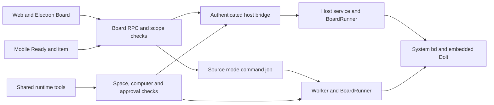

# Board

Board lets an operator create dependent work, find work that can start, assign it
to a bot, and review the result. Builders can keep that work in an existing
folder board. Researchers can read the dependency graph and export JSONL. Team
leads can group children under epics. Local-first users keep issue data in the
owner's installed Beads database.

## Provider and execution

`ProjectBoardProvider` lives in `packages/adapter-kit/src/board.ts`. Adapter-kit
already defines several provider boundaries; it is not limited to sandboxes.
`WorkItem`, RPC schemas and bridge payloads live in
`packages/contracts/src/board.ts`. `BeadsBoardProvider` implements the interface
in `packages/adapters/src/board/beads.ts`.



Packaged operation uses `board.run` on the existing authenticated host bridge.
The host runs the installed `bd` found on its login PATH. Human source-mode
requests use a `board.run` background job so execution happens in the worker;
`board_commands` is a transient request/result table with deadlines. Its queued
to running transition prevents a job retry from replaying a mutation. A crash
after a mutation but before its response requires checking the board before
retrying; it cannot be made transactional with the application database.

The runner uses `execFile` with an argv array and `shell: false`. It accepts a
complete allowlist of command grammars, resolves a registered folder root,
rejects database redirects and escaping metadata paths, and serializes reads
and writes by real workspace path. The command deadline includes queue wait.
External lock conflicts return `Another write is in progress`. No board command
installs software or invokes a shell.

The owner and space membership are checked before every call. Bots additionally
must belong to the space and reach the owner's computer. Actor names come from
the account display name or `bot:<bot name>`, never Git configuration. Remote
read-only grants allow workspace, snapshot and item reads and reject mutations.

## Workspaces and initialization

The default board is initialized on first use at
`<app home>/board/<space id>/.beads/`. The space-id segment is intentional: using
one `<app home>/board/.beads/` for every space would share unrelated work. Prefixes
are derived from the space name. `board_workspaces` records kind, path, prefix,
enabled state and ownership. Existing folder prefixes are read from Beads.

Registered folders appear in the picker. Existing `.beads/` folders are opened
directly. An empty registered folder requires the owner to choose
`Start a board in this folder`; a dialog lists the files before initialization.
The exact initialization flags tested against `bd version 1.2.2 (6c124203e)` are:

```text
bd --json --actor <display name> --sandbox --dolt-auto-commit off init --non-interactive --skip-agents --skip-hooks --stealth --prefix <prefix>
```

Initialization sets the confined working directory through `execFile`, because
1.2.2 rejects `-C` for an uninitialized folder. Later calls use `-C <root>`.
`--skip-agents` also skips agent integrations. `--skip-hooks` skips hooks.
`--stealth` avoids the initialization Git commit. Git discovery is disabled for
the child process as well, so stealth mode does not edit `.git/info/exclude`.
These flags were checked with `bd init --help` and the
[1.2.2 initialization source](https://github.com/gastownhall/beads/blob/v1.2.2/cmd/bd/init.go).

The verified initialization writes these entries, all inside `.beads/`:

- `config.yaml`, `metadata.json`, `.gitignore`, `README.md`
- `interactions.jsonl`, `.local_version`, `embeddeddolt/` and its database files

New boards also run `config set types.custom spike,story,milestone`. Existing
boards keep their configuration. Priorities are P0–P4. The interface offers the
six built-in issue types plus those three custom types. If an existing board
does not configure a custom type, Beads remains authoritative and rejects it.

Child-only environment settings disable metrics, event flushing, hooks, shared
server selection, remote operations and Git identity discovery. The runner
removes inherited `BD_*`, `BEADS_*`, `GIT_*` and `DOLT_*` overrides before setting
`BEADS_DIR`, `BD_DB`, `BD_DOLT_SHARED_SERVER=false`, `BD_NO_HOOKS=true`,
`BD_DISABLE_METRICS=1`, `BD_DISABLE_EVENT_FLUSH=1`, `BEADS_NO_GIT_OPS=true`,
`BEADS_DOLT_LOCAL_ONLY=true`, `GIT_DIR=<null device>`,
`GIT_CONFIG_GLOBAL=<null device>` and `GIT_CONFIG_NOSYSTEM=1`.
`bd metrics off` exists but changes global preferences, so this feature uses the
per-process opt-out supported by the
[metrics source](https://github.com/gastownhall/beads/blob/v1.2.2/internal/metrics/metrics.go)
and [configuration source](https://github.com/gastownhall/beads/blob/v1.2.2/internal/config/config.go).

The tested embedded workspace works without a separate `dolt` executable on
PATH. Discovery reports whether it is installed, and command failures identify
a missing Dolt executable if the installed Beads build requires one. Server-mode,
redirected, symlinked and escaping databases are outside this implementation's
scope. The supported version gate is 1.2.x.

When `bd` is missing, the page shows `Beads is not installed on this computer`
and links to the [official installation instructions](https://github.com/gastownhall/beads/blob/v1.2.2/README.md#installation),
including `brew install beads` and `npm install -g @beads/bd`. Installation is a
human action.

## Board and bot behavior

`/app/board` shows Ready, In progress, Blocked, Deferred and Done. Done contains
items closed during the last seven days. Ready and Blocked use Beads results;
the application does not infer readiness from a cached dependency list. Pinned
items appear in Deferred and hooked items in In progress. Search, type, label,
assignee and epic filters narrow the board. The dependency view uses inline SVG;
the epic view shows child completion counts.

The item drawer shows description, acceptance criteria, Blocks, Blocked by,
comments and available history. New-item and edit forms keep parent, dependencies,
labels, assignee, due date and defer date behind More. Export writes JSONL under
`<app home>/board-exports/<space id>/` and displays the path. JSONL is interchange,
not a full Dolt backup.

`board_ready`, `board_show`, `board_create`, `board_update`, `board_claim`,
`board_close`, `board_comment` and `board_link` use the shared tool registry for
all supported runtimes. Reads are read-only; writes go through the existing
low-risk action approval rules. Webhook authority does not bypass approvals.
There is no delete tool.

Send to a bot creates a normal conversation turn containing the item's title,
description and acceptance criteria. The item becomes in progress, assigned to
`bot:<bot name>`. Its workspace and item ID are saved on the run before enqueue.
Duplicate dispatches use the normal conversation nonce. Active runs prevent
sending the same item again or steering an already busy bot into a different item.

The completion hook comments with the outcome. Reconciliation retries missed
outcome comments after crashes or host disconnections; a run marker prevents
duplicate comments. Automatic closing requires a completed run, permission saved
when dispatched, and the item's current `Close when the bot reports done` switch.
The switch is off by default; turning it off revokes a pending automatic close.
Failed and cancelled runs report their outcome without closing. Bot tools cannot
change this switch or close a dispatched item without that permission.

Mobile offers a read-only Ready list and item view, including workspace selection,
dependencies, acceptance criteria and comments. Every new mobile string has
Russian and Chinese catalog entries; English is the source catalog.

## Limits and review decisions

- Neither Git nor automatic Dolt commits, remote configuration, pushes or global
  settings changes are performed. `bd history` reads existing committed Dolt
  versions. A freshly initialized board therefore has an empty history panel;
  comments and current state remain available. The JSON envelope is checked
  against [Beads' versioned history contract](https://github.com/gastownhall/beads/blob/v1.2.2/internal/storage/versioned.go).
- The queue protects one running host process. Separate processes are coordinated
  by embedded Dolt's own lock; lock errors are surfaced without removing locks.
- Commands have a 30-second host deadline, a 2 MiB response bound, and a bounded
  queue. Very large boards can exceed these limits and return a structured error.
- The UI and provider add no runtime dependencies or required hosted service.
  Ordinary model costs still apply when work is sent to a bot.
- `apps/web/src/pages/shell/top-nav.ts` was absent. Board is placed beside Team
  in `Shell.tsx`; if the dashboard stream introduces `registerTopNavItem`, register
  Board at order 30 when combining those changes.
- Apply `20260925110000_beads_board` through the normal application migration
  process before opening Board. Generation and offline tests do not prove a live
  deployment has applied the schema.

See [verification evidence](board-verification.md) for the tested commands,
recorded real-command JSON, UI walkthrough and remaining acceptance checks.
