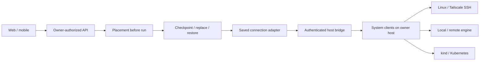

# Fleet P1

Fleet lets the operator place a computer where capacity is available. Builders keep their
workspace through a checkpoint when a computer moves. Researchers can run the same work on
another engine. Team leads see assignments on the Team board. Local-first users can use existing
machines without a hosted service. Mobile shows the fleet and capacity without configuration
controls.

## Connection and execution

`SandboxProvider.capacity` returns `CapacitySnapshot`. Missing measurements are `null`, never
zero. `choosePlacement` considers connected targets with measurements no older than 30 seconds.
Probes are cached for 30 seconds, have time and output limits, and run four at a time.

| Target | Connection | Work | Capacity | Limits |
| --- | --- | --- | --- | --- |
| This Mac | Existing authenticated host bridge | Host tools and supported pinned native runtimes | Host OS CPU, load, free memory, filesystem | Registered folders remain host-only; portable checkpoints contain the computer home |
| Existing local Docker/Podman computers | Existing supervisor, selected Unix socket | Existing graphical computer | Engine info and supervisor host statistics | Existing supervisor topology and screen rules apply |
| Added Docker, OrbStack, Colima, Podman targets | Owner host CLI with socket or saved Docker context | Headless container, terminal, isolated named volume | Engine info plus host statistics; Podman reports host free memory | No graphical screen on these added targets; local VM headroom is bounded by host memory |
| Remote Docker/Podman | System SSH to the remote engine CLI, or TLS engine endpoint | Headless container and engine-owned volume | Engine info plus SSH host statistics; TLS-only Docker free memory is not reported | Selected image must already exist on the engine; no automatic pull or build |
| kind and existing Kubernetes | Saved context and namespace; existing provider with direct API in development, host `kubectl` transport when packaged | Pod and persistent volume claim | Schedulable-node allocatable minus requests; metrics when available | Certificate/token HTTPS kubeconfig; no credential plugins; namespace and storage must exist; no screen/terminal |
| Linux machine | System SSH; agent, encrypted private key, or Tailscale SSH; optional jump host | Commands, files, interactive terminal, per-computer home | `nproc`, `/proc/loadavg`, `/proc/meminfo`, `df` | Bash, Python 3, SFTP and a verified SSH host key are required |
| Tailscale peer | Existing host CLI login discovers online Linux peers; added as SSH | Same as SSH | Same as SSH after adding | Tailnet policy and SSH access must already permit the connection; no Tailscale keys are stored |

Computers shows the host, the local Docker engine, the deployment default when it is neither of
those, and each saved connection. Clients name these built-in rows in their own language from a
stable key and the host label the API returns: This Mac when the paired desktop, or else the
server, runs macOS, and This computer elsewhere. The default row carries the kind its provider
creates; kinds outside the fleet list, such as none or fake, stay on the default row. A
connectionless E2B, Daytona, or Box computer on another deployment gets its own row while that
provider's key is set. A computer whose engine is not configured is not listed on any row.

Docker context discovery accepts the CLI's JSON-lines output. OrbStack and Colima sockets are
found at their standard locations. Podman machine discovery uses its reported socket. Tailscale
rows show MagicDNS and the advertised address. Tags are not generally login names: only the
explicit `tag:ardurbot-user-<login>` convention prefills a different login. Otherwise the host's
current login is used and remains editable. An advertised `sshHostKeys` list selects Tailscale SSH.

SSH and remote engine processes originate on the owner's machine in packaged installations.
Development uses the worker's system clients. No incoming listener or published container port is
added. The existing authenticated host bridge uses the `computer.remote.*` operation family.
Existing Kubernetes connections created before Fleet keep their original transport; add the
context again to use host transport for a loopback-only kind API.

## Placement and recovery

`Manual` is the default. `Prefer the most free memory` chooses a target with more free memory.
Threshold mode keeps the current target while it has at least the configured amount, default
4 GB. Below that threshold it uses a healthy preferred target or the target with the most free
memory. It never chooses an unknown, stale, disconnected, or merely discovered target. Ties stay
where they are. CPU load is reported separately and is not treated as memory capacity.

Automatic moves stay inside one engine family until verified migration lands. Local Docker and
remote Docker (a socket, an endpoint, or a Docker context) are one family, and Podman connections
report those same kinds; every other kind is its own. Moving work to another family waits because today's move removes the old computer before the
new one has accepted the workspace. Settings can move a computer to a saved connection, and a
connected computer back to Docker when that is the deployment default. Moving a computer onto the
machine running Ardur Bot is refused until verified migration lands. If the computer changes
before an automatic move starts, the move is skipped: the run's placement records it, and no
computer update is shown.

`placeRunComputer` runs before the first computer execution lease and before tool effects. It
never moves an existing run snapshot. A first move pauses for that bot's consent unless `Move
automatically` is enabled. The conversation links to Computers while consent is pending.
Consent is remembered. Disabling automatic moves revokes remembered
consent. Switching back to Manual resumes placement-paused runs on their existing computers.
The existing Ask-first rules still apply to commands and other tool effects after placement.

A Team Computer is one shared home. It moves as a unit only after all its attached bots consent
and no other run is active. Use private computers for independently placed workloads. Native
runtime pins retain their existing host restriction; placement never changes a runtime or model
pin to make a destination work. Explicit connection changes retain the chosen destination;
automatic placement evaluates first use after creation or replacement at the next new run.

Every run, reset, update, recovery, sleep, screen and terminal operation uses the computer's saved
connection, or without one the provider of its saved kind. The kind is chosen when the computer is
created, so changing This Mac or the deployment default does not move an existing computer. A
computer whose engine is not configured is handled as described in
[computer runtime](computer-runtime.md#daytona-backend).

Moves reserve the computer using the existing maintenance record, save a checkpoint with the old
connection, destroy the old computer, then provision and restore with the new connection. The
destination is resolved once before the checkpoint, so switching This Mac during a move does not
change where the new computer starts. Once the old computer is gone, the record names the
destination, so a failed start is retried there. A failed checkpoint prevents teardown. A failed
restore leaves the durable checkpoint and a failed maintenance record available for recovery. The
run's `placement` snapshot and a conversation message retain `Moved to {computer}: {reason}`.
There is no live process migration.

Capacity is a recent observation, not a reservation. Kubernetes totals do not guarantee that a
single node, a volume topology, or quota can satisfy a pod. SSH uses the remote account's existing
permissions: its file API confines paths and refuses symlinks, but SSH is not an operating-system
sandbox. Use a dedicated Linux account for workloads that need that separation.

## Security and bounds

OpenSSH runs with an argv array, BatchMode, strict host-key checking, agent forwarding disabled,
and explicit connection options. Every remote argument is shell-quoted once because SSH joins
remote argv for the server shell. Commands keep the normal command-block audit path. File
transfers use SFTP and private temporary staging; descriptor-based traversal keeps the file API
inside the computer home. Checkpoints use bounded tar streams with path, type and checksum
validation. Special files and symlinks are excluded.

Private keys and TLS material are imported on the host into the existing encrypted-secret format.
Only an opaque reference enters connection metadata. The system clients receive temporary files
with mode 0600, removed when an operation finishes. Agents stay on the host. Bridge authorization
checks owner, space, saved connection, home, active run or maintenance grant, and terminal lease.
Disconnection closes terminals. Kubernetes host transport accepts only the provider's exact
non-root pod/PVC specifications and embedded HTTPS kubeconfig credentials.

Direct SSH/container transfers allow 16 MiB per file and a 64 MiB checkpoint. Host bridge transfers
retain the existing 128 KiB file-operation limit and 8 MiB total response limit. Checkpoints
exceeding an export limit fail before source teardown. A destination write-limit failure retains
the checkpoint for recovery. Kubernetes host writes retain the 128 KiB input limit. Break large
artifacts into smaller files or keep their computer binding until a larger streaming protocol is
implemented. SSH commands are bounded by the existing command timeout (maximum five minutes).
Interactive terminal sessions expire with their control lease, at most 30 minutes, and are bounded
across connections.

There is no new runtime dependency. The feature uses system `ssh`, `sftp`, container CLIs and
`kubectl`. Remote compute, image storage and Kubernetes PVCs can incur the owner's existing
infrastructure charges; the feature does not provision machines or purchase services.

## Manual verification

1. Build and start the updated API, worker, web and host service. Apply the generated Fleet
   migration to the development database using the project's migration workflow. Check that
   **Settings → Computers** shows **This Mac** and its capacity. Keep the host service connected.
2. On a Linux test machine, provide a dedicated account with Bash, Python 3 and SFTP. Establish
   and verify its host key from the owner's terminal, and confirm noninteractive SSH succeeds.
   In **Add computer → SSH machine**, enter a label, host and login. Keep **SSH agent**, or choose
   a host-local private key file. Set the port, jump host or remote base directory under
   **Advanced** only if needed. Add it and press **Test**. Confirm OS, version, CPUs and memory.
3. In a bot's computer connection selector, choose the SSH target and apply the change. Run a
   command that creates a small text file. Read it through Files, open the terminal, sleep and
   wake the computer, and confirm that the file remains. Verify that a command requiring
   approval still pauses before executing. Confirm that the remote home is a generated child
   of the configured base, not the account's home itself.
4. Sign in to Tailscale using its existing host CLI. Make an online Linux peer reachable under
   the tailnet policy. Reopen Computers, choose **Add as SSH computer** on its row, check the
   prefilled login and authentication, then add and test it. A peer without advertised SSH
   host keys uses ordinary SSH agent authentication. No Tailscale authentication material is
   entered in the application.
5. Add an engine discovered through its socket/context, or a remote SSH/TLS engine. Place the
   selected Ardur Bot image on that engine first. For TLS, provide host-local CA, certificate
   and key paths. Test it, select it for a private bot, create a file, and verify sleep/wake and
   checkpoint restore. Confirm no port is published by the new container.
6. Select a discovered kind or existing Kubernetes context. Choose an existing namespace and
   storage settings. For kind, load the selected computer image using the normal kind image
   workflow. Add and test it. Confirm pod/PVC ownership labels and persisted files. Remove
   metrics access temporarily on a disposable fixture and confirm CPU load is unknown while
   capacity based on requests remains available. Do not change production cluster permissions.
7. Put a private, Pi-runtime bot on one Linux machine, create a small marker file, and set
   Placement to **Prefer the most free memory**. Use a second connected Linux machine that reports
   more free memory. Start new work, accept **Move** once, and confirm the Team board and fleet
   assignment change, the marker survives, and the conversation records the reason. For threshold
   mode, use a test threshold above the first machine's reported free memory and below the
   destination's free memory; there is no need to deliberately exhaust the machine. Confirm a
   running command stays on its original computer and the next new run evaluates placement.
   Confirm a Docker or This Mac computer is not moved automatically to a Linux machine.
8. Open mobile account settings. Confirm the same computers, assignments and free-memory bars,
   with no Add, Test, placement or credential controls. Disconnect a test target and confirm
   that stale/unknown capacity does not become a placement candidate.

## Verification sources

The implementation was checked against primary documentation:

- [OpenSSH `ssh(1)`](https://man.openbsd.org/ssh.1) and
  [`ssh_config(5)`](https://man.openbsd.org/ssh_config.5): remote command joining, BatchMode,
  host-key checks, identity options and jump hosts.
- [OpenSSH `sftp(1)`](https://man.openbsd.org/sftp.1): batch transfers and SSH options.
- [Docker daemon access](https://docs.docker.com/engine/security/protect-access/): outbound SSH
  and authenticated TLS; plain TCP is not accepted.
- [Docker contexts](https://docs.docker.com/engine/manage-resources/contexts/) and
  [`docker context ls`](https://docs.docker.com/reference/cli/docker/context/ls/): context selection
  and JSON formatting.
- [Docker Engine API 1.47 schema](https://raw.githubusercontent.com/moby/moby/v27.3.1/docs/api/v1.47.yaml):
  `/info`, `NCPU`, `MemTotal`, OS and version fields. Docker info alone does not report free memory.
- [Docker resource constraints](https://docs.docker.com/engine/containers/resource_constraints/):
  CPU and memory limits for added engine containers, defaulting to 2 CPUs and 2 GiB.
- [Podman CLI](https://docs.podman.io/en/latest/markdown/podman.1.html) and
  [Podman info](https://docs.podman.io/en/latest/markdown/podman-info.1.html): service URL, TLS
  options, host capacity and version JSON fields. Podman TLS needs a version supporting the
  documented `--tls-ca`, `--tls-cert` and `--tls-key` options; older clients can use SSH.
- [Kubernetes resource requests](https://kubernetes.io/docs/concepts/configuration/manage-resources-containers/)
  and [metrics pipeline](https://kubernetes.io/docs/tasks/debug/debug-cluster/resource-metrics-pipeline/):
  allocatable/request accounting and optional observed usage.
- [`kubectl config view`](https://kubernetes.io/docs/reference/kubectl/generated/kubectl_config/kubectl_config_view/):
  merged contexts and flattened, minified configuration snapshots.
- [Tailscale CLI](https://tailscale.com/docs/reference/tailscale-cli) and the
  [official status types](https://github.com/tailscale/tailscale/blob/main/ipn/ipnstate/ipnstate.go):
  `status --json`, online peers, DNS/IPs, tags and the exact `sshHostKeys` JSON spelling.
- [Tailscale SSH](https://tailscale.com/docs/features/tailscale-ssh): existing tailnet policy and
  login prerequisites.

## Copy and upstream notes

Primary controls are **Computers**, **Add computer**, **Test**, **Placement**, **Manual**,
**Prefer the most free memory**, **Move when this Mac has under {n} GB free**, **Move automatically**,
**Move**, and **Keep here**. Rows show **Connected**, **Available**, **Unavailable**, **Memory not
reported**, and **{amount} GB free**. **Moved to {computer}: {reason}** appears only after a move.
Form labels identify the selected authentication, endpoint and namespace. Advanced paths, resource
limits and certificates are disclosed only while adding the relevant connection. Failure text
appears only after a failed operation. These words identify actions and consequences; there is
no persistent explanatory panel.

New transport code lives under `packages/host-runtime/src/fleet/` and
`packages/adapters/src/fleet/`; the web feature lives under `apps/web/src/pages/fleet/`.
Shared contracts, routing, capacity and run placement are small hooks into existing packages.
`SshSandboxProvider` participates in `sandbox-conformance.test.ts` with fake SSH/SFTP transport.
`fleet.spec.ts` captures the fleet screen for CI; link its resulting artifact when publishing a PR.
Native-only mobile rendering has deterministic tests rather than an unrelated web screenshot.
The migration is `20260925100000_fleet` and uses mapped table names. Its timestamp places it after
the existing customization migrations; their SQL is unchanged.
