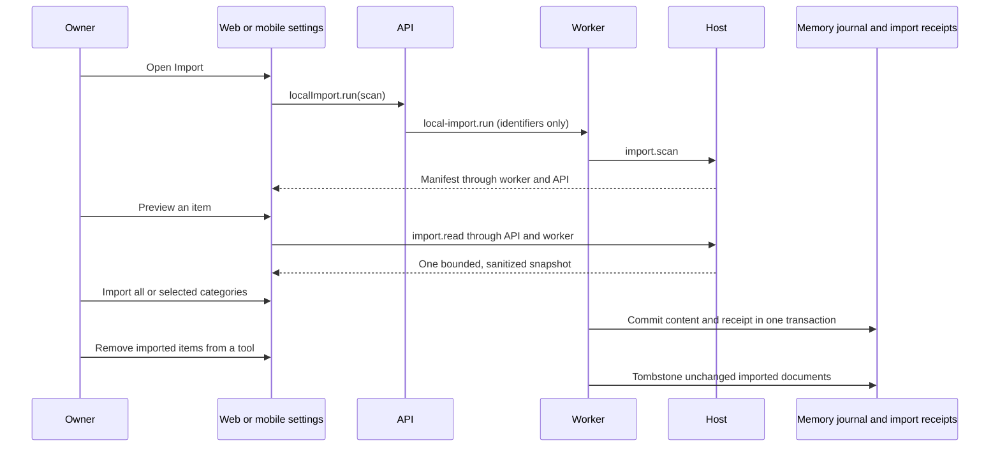

# Import local tool data

The deployment owner can open Settings → Customize → Import to find instructions, memories,
skills and MCP server definitions on the host computer. Discovery is automatic;
the first import requires a click. The local-first user can reuse existing work
without uploading files. The operator can inspect provenance, rescan and undo.
The builder gets the same contracts on web, Electron and mobile.

## Flow and ownership

`LocalImportScanner` in `packages/host-runtime/src/import/scanner.ts` runs on the
owner's host. Packaged deployments use `HostAgent` over the authenticated host
bridge. Source deployments use the worker's captured login environment. No source
tool command, hook, plugin entrypoint or server is started during import.

`HostBridge.authorize` accepts the import operations only for the paired deployment
owner who also owns the current space. Import jobs use a distinct scope rather
than borrowing a bot run. The service rechecks ownership before mutations and
serializes receipt changes with a database advisory lock.

The manifest contains names, relative paths, sizes, modification times, counts
and SHA-256 hashes, never bodies. A read accepts only an opaque item identifier
from the latest scan. Bodies remain in the host's bounded snapshot until another
scan or process exit. Preview responses are not stored in background jobs or the
database. A restart requires a rescan. A scan does not crawl unregistered project
directories.

## Supported sources and format evidence

Defaults are relative to the captured home directory. Windows uses `USERPROFILE`;
Linux uses `HOME`. Claude desktop defaults exist only on macOS and Windows. A
custom source folder is exposed only when that tool's default is absent and must
resolve inside the home directory.

| Tool | Imported | Reported only | Format source |
| --- | --- | --- | --- |
| Claude Code | Global `CLAUDE.md`; project `memory/*.md`, including `MEMORY.md`; `SKILL.md`; `mcpServers` in settings and the root configuration; registered project `CLAUDE.md` | Installed plugin registry and marketplace plugin manifests; supporting skill files | [Memory](https://code.claude.com/docs/en/memory), [skills](https://code.claude.com/docs/en/skills), [MCP configuration](https://code.claude.com/docs/en/mcp), [plugin reference](https://code.claude.com/docs/en/plugins-reference) |
| Codex | Global and registered project `AGENTS.md`; `SKILL.md`; `developer_instructions`; a confined Markdown/text `model_instructions_file`; `mcp_servers`; recognized memory text columns from `memories_*.sqlite` | Unsupported SQLite schemas, unsupported configuration, supporting skill files | [Configuration reference](https://developers.openai.com/codex/config-reference/) |
| Kimi | `mcpServers` definitions in `mcp.json`, and defensive compatibility discovery in `config.toml` and `kimi.json` | Plans and configurations without supported server definitions | [Data locations](https://moonshotai.github.io/kimi-cli/en/configuration/data-locations.html), [MCP](https://moonshotai.github.io/kimi-cli/en/customization/mcp.html) |
| Cursor | Global rules and registered project `.cursor/rules/*.mdc` / `.cursorrules` as instruction documents; skills from both skill directories; `mcp.json` | Agents, hooks, supporting skill files | [Rules](https://cursor.com/docs/rules), [MCP](https://cursor.com/docs/context/mcp) |
| Gemini CLI | `GEMINI.md`, skills and `settings.json` MCP servers | Unsupported server constraints and supporting skill files | [Context files](https://geminicli.com/docs/cli/gemini-md/), [skills](https://geminicli.com/docs/cli/skills/), [MCP](https://geminicli.com/docs/tools/mcp-server/) |
| Hermes | `SOUL.md` as instructions and discovered `SKILL.md` files | Only model/provider names from `config.yaml`; supporting skill files | [Configuration](https://hermes-agent.nousresearch.com/docs/user-guide/configuration/) |
| Claude desktop | `claude_desktop_config.json` MCP servers | MCPB/DXT extension manifest counts and names | [MCPB manifest specification](https://github.com/modelcontextprotocol/mcpb/blob/main/MANIFEST.md) |

The Kimi CLI documentation above describes `.kimi`. A separate
[Kimi Code documentation site](https://www.kimi.com/code/docs/en/kimi-code-cli/customization/mcp.html)
describes `.kimi-code`. This implementation keeps the requested `.kimi` default;
the missing-default folder setting supports the alternate installation.

The Codex memory database schema and Claude Code's installed plugin registry are
internal formats, not stable import APIs. SQLite discovery inspects the schema,
excludes virtual tables and selects only explicitly named text columns from
memory tables. It never selects session, transcript, credential or token columns.
Unrecognized schemas remain visible with a reason. Registry parsing takes plugin
names only and does not inspect installation credentials.

The workspace contains `smol-toml` and `@iarna/toml` transitively through build
tools. Neither is a declared runtime dependency of the host. To keep the requested
dependency boundary, `formats.ts` implements a bounded data-only TOML subset for
strings, arrays, inline maps and dotted/quoted tables. It rejects unsupported or
ambiguous syntax. No runtime dependency or provider-specific environment variable
was added.

## Privacy and limits

Excluded path components include sign-in files, credential stores, cookies,
tokens, OAuth caches, transcripts, session and chat histories, telemetry, caches,
backups, private-key files and `.env` files. The scanner does not descend into
these locations. Symlinks must resolve inside the captured home and cannot resolve
to an excluded path. Text files are opened without following their final symlink
and checked for replacement; hard-linked text files are rejected.

MCP parsing discards every environment and static header value, including values
that are not obviously secret. Only names and documented environment-to-header
bindings survive. Credential-bearing arguments and URLs with credentials or query
parameters are report-only. Working-directory, tool-filter and special
authentication configurations that the current registry cannot reproduce are also
report-only. Imported definitions retain their disabled state. They receive no
bot assignment or tool permission from import.

Recognizable credential assignments in otherwise eligible text are redacted before
preview, hashing and import. The hash describes the eligible projection, so changing
an excluded environment value does not create a new revision. Report-only entries
use a metadata identity hash because their bodies are unavailable for import.

Limits are 4,096 items, 4,096 visited directories, four levels of recursive
discovery, 96 KiB per imported body and 16 MiB of retained bodies per scanner.
Configuration reads are bounded at 2 MiB. SQLite files are bounded at 64 MiB, with
at most 32 inspected tables and 1,024 rows per supported table. Bodies over 96 KiB
within the source-read limit are reported without importable content; larger text
files are skipped without opening. Recognized unsupported formats are reported;
excluded paths are not listed. Scanner errors never return parser input or absolute
paths.

Imported server values must be entered anew through **Set up servers** or MCP
server settings. `saveImportedServerCredentials` stores them with the existing
authenticated encrypted store and clears the form after saving or cancelling.
The connector refuses a connection while required values are absent. Import does
not expand the existing stdio command policy or add a host-side MCP execution
transport; server execution remains subject to the deployment's MCP capabilities.
When an imported server definition changes, its encrypted credentials and pending
OAuth sessions are removed, and existing bot assignments require review. OAuth
callbacks and refreshes must match the imported connection revision. An unchanged
definition retains the owner's setup.

## Lifecycle and automatic refresh

`LocalImportConfig` stores owner settings and the latest manifest.
`LocalImportRecord` stores tool, relative source path, source-path hash, eligible
content hash, source modification time, import time and the target revision.
Both tables have explicit mapped names in migration
`20260925120000_local_import`.

Instruction files remain private user documents under `imported/instructions/`,
with provenance kind `instructions`. The account settings now include space-wide
instructions; merging that setting does not promote existing private imports to
shared instructions or change their revision and undo behavior.
Memory notes use the existing memory lifecycle directly;
they do not create learning proposals. Their provenance sets
`authorizesIntent: false`. Learning and revision history show the source tool.
Runtime memory writes cannot overwrite imported source documents.

Skills use the existing file-backed agent skill catalog and memory journal. Names
remain unchanged unless they collide, when the tool name is prefixed. Supporting
scripts, references and assets are reported separately and are not installed; a
skill that depends on them needs those resources before it can run fully.

Reimport skips matching hashes and creates revisions only for changed source
content. Equal memory bodies in the same category share a document while retaining
separate source receipts. A changed shared source splits into its own document.
If the owner changed the target after import, import and undo report a conflict
and preserve the owner's version.

Undo tombstones documents through the existing journal, hides removed skills and
deletes unchanged imported MCP rows and their owned encrypted credentials. Other
tools' shared documents survive. Undo switches automatic import off. Source files
are never modified or removed. Source deletion alone does not delete imported
material; removal is explicit.

**Auto-import changes** is off by default and becomes available after the first
successful import. It remembers the imported tool/category selections.
Category changes while automatic import is enabled take effect immediately.
Graphile's existing recurring-job scheduler checks hourly; the in-memory development queue
uses the existing job reconciler. A persisted hourly claim makes repeated ticks
idempotent. Revoked ownership or disabled consent prevents subsequent mutations.

## Merge points and verification

The extension and plugin installers coexist with import. Import's minimal MCPB
reader still reports manifest metadata without installing or executing bundles.
Connecting discovered bundles to the validated installer remains a separate change.
Import is an owner-only, lazy-loaded entry under Customize in `settings-sections.ts`.
The shared MCP serializer retains import provenance alongside host placement,
extension ownership, tool policies and argument redaction. The scheduler retains
weekly learning, ten-minute brief maintenance and hourly import refresh; Graphile's
cron metadata is removed before all strict job payload validation.

Deterministic fixture tests cover host scanning, exclusion and size rules, latest
scan IDs, imported lifecycle behavior, credentials, owner authorization, hourly
idempotency, learning labels and both frontends. The PostgreSQL integration test
checks real migration-backed transactions and encrypted credential cleanup. The
web E2E scenario captures discovery, preview, imported and removed states for CI
screenshots. Native mobile rendering is covered with native-control test doubles;
a physical-device acceptance pass remains a separate manual check.

Import invokes no model or paid provider. It consumes bounded local file reads and
ordinary database storage. If the owner has already configured an external semantic
memory provider, the existing memory lifecycle can deliver imported documents to
that provider using its normal settings and costs.
