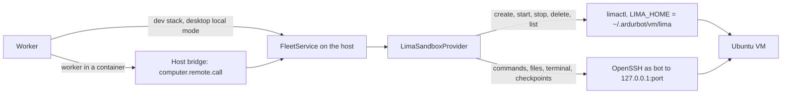

# Virtual machine computers (design)

Status: design only; nothing in the app creates or manages virtual machines yet.
The reviewed Lima template is
[`infra/sandboxes/vm/lima-computer.yaml`](../infra/sandboxes/vm/lima-computer.yaml); it passes
`limactl validate` with Lima 2.2.0 for both `vz` and `qemu`, but no VM has been booted from it. Points that still need a live run are marked **To verify** and listed in
[What is not verified yet](#what-is-not-verified-yet).

A bot on a container computer cannot build containers or start a kind cluster safely: the
container has no engine, the host engine's socket would hand over every container on that engine,
and kind needs privileged node containers, which the Kubernetes path forbids. A virtual machine per
computer moves the boundary one layer down. Builders test containers and clusters without risking
their machine. Local-first users need no hosted service. Operators get fixed resource limits, sleep
and wake, and a single place to remove what a computer left behind.

## What the owner gets

- A new computer kind, **Virtual machine** (engine and kind `vm`). Each bot computer placed on a
  virtual machine connection gets its own VM; a Team Computer is one VM shared by its bots.
- The VM is a full Ubuntu 24.04 LTS system with Docker Engine (rootless, with Buildx and Compose),
  kind and kubectl. `docker run hello-world` and `kind create cluster` work from the bot's shell.
- It runs on the owner's machine through [Lima](https://lima-vm.io/): Apple's Virtualization
  framework (`vz`) on macOS 13 or later, QEMU with KVM on Linux. Lima is installed by the owner
  (for example `brew install lima`); Ardur adds no dependency and bundles no hypervisor.
- **Windows is not offered.** Lima lists Windows hosts as untested on its
  [installation page](https://lima-vm.io/docs/installation/), and its
  [WSL2 driver](https://lima-vm.io/docs/config/vmtype/wsl2/) is experimental, needs rootfs
  archives instead of disk images, and leaves many options unsupported. The **Virtual machine**
  option is not shown when the host is Windows. A Windows owner can run a Linux VM they manage
  and add it as an SSH machine, which [Fleet](fleet.md) already supports.
- The bot is an ordinary user inside its VM, not root. It is root inside its own containers.
  [Security model](#security-model) explains why: Lima's default network lets a guest reach every
  service listening on the host's localhost, and only a firewall the bot cannot change closes that.
- A VM always reaches the public internet. A computer whose network access is turned off cannot
  use one ([Network access](#network-access)).

## Architecture



### Provider

`LimaSandboxProvider` (new, `packages/host-runtime/src/fleet/lima.ts`) extends
`LinuxFleetSandbox`, like `SshSandboxProvider`. Lifecycle calls go to `limactl`. Everything else
(commands, files, the interactive terminal, workspace export and import) goes through an internal
`SshSandboxProvider` per VM, pointed at `127.0.0.1:<sshLocalPort>` as the guest user `bot`. It
reuses Fleet's OpenSSH argv, BatchMode, strict host keys, SFTP staging, descriptor-confined file
scripts, bounded tar checkpoints and `FleetTerminal`, so none of that is written twice.

```ts
export class LimaSandboxProvider extends LinuxFleetSandbox {
  constructor(settings: ComputerConnectionSettings, options: {
    limaHome: string;            // ~/.ardurbot/vm/lima
    deployment: string;          // label: first 16 hex of SHA-256 of the deployment id
    processes?: FleetProcess;    // tests inject a fake limactl on PATH
    platform?: NodeJS.Platform;
  });
  describe(): SandboxDescriptor; // id and kind "vm", FLEET_LINUX_CAPABILITIES
  provision(): Promise<ComputerRef>;  // derives the name, refuses network off; no VM work
  prepare(): Promise<void>;           // create if missing, start if stopped, check readiness
  stop(): Promise<void>;              // LinuxFleetSandbox.stop, then limactl stop
  destroy(): Promise<void>;           // limactl delete --force, then drop the host-key pin
  supportsNetworkEgress(): Promise<boolean>; // false: network access cannot be turned off
  capacity(): Promise<CapacitySnapshot>;
  test(context): Promise<{ os: "Linux"; version: string; capacity: CapacitySnapshot }>;
  images(ids: string[]): Promise<ImageState[]>; // this deployment's image references
  reconcile(instances: { name: string; active: boolean }[]): Promise<ReconcileResult>;
  remove(name: string): Promise<void>; // an unused VM, after the owner confirms
  closeAll(): Promise<void>;           // stop running VMs when the app quits
}
```

Two rules hold for every call on the host:

- **One operation per VM at a time.** A lock per instance name, shared by every provider object
  in the process, serializes `prepare`, `stop`, `destroy`, `remove` and the reconciler's stops for
  that VM, and records when each VM last had a provider call.
- **A stopped VM is started first.** Every SSH-backed call (commands, files, the terminal, export
  and import) reads the instance's status and, if it is `Stopped`, runs the wake path before it
  connects. After Quit, computer rows can still say running while their VMs are stopped; a
  checkpoint, a file listing or a terminal then wakes the VM instead of failing.

The VM name is `ardur-` plus the first 16 hex characters of
`fleetComputerKey(spaceId, homeKey)`, the same hash Fleet already uses for SSH homes and remote
containers. It is shorter than a container's name because of Lima's socket path limit (see
[Ardur's Lima home](#ardurs-lima-home)). It is deterministic, so the API can compute every VM name
from its computer rows without a stored reference. The `ArdurComputer` label records the first 24
characters, and `prepare` refuses an existing instance whose labels do not match the computer and
the deployment. The reference is `vm:<name>`; `fresh` is true when the instance did not exist yet.

### Lima commands

Every call is an argv array through `FleetProcess` (no shell), with `LIMA_HOME` set to Ardur's own
directory and `--tty=false` so nothing prompts. `limactl` is resolved from the owner's `PATH` with
the existing `resolveHostBinary`.

| Operation | Command | Notes |
| --- | --- | --- |
| Check | `limactl --version` | Parse `limactl version X.Y.Z`; require 2.2.0 or later, the version the template was validated with. |
| Create | `limactl --tty=false create --name <name> --set .vmType="vz" --set .cpus=2 --set .memory="4GiB" --set .disk="40GiB" --set .images=[…] --set .param.ArdurComputer="…" --set .param.ArdurDeployment="…" <template>` | `<template>` is the embedded template written to a private temporary file. `cpus`, `memory` and `disk` come from the connection's resource fields (see [Contracts](#contracts)). `.images` points at Ardur's verified local image (see [Image download](#image-download)). Values are JSON-encoded from validated settings. `create` only writes the instance's configuration; Lima copies the image into the instance at the first `start` ([`start.go`](https://github.com/lima-vm/lima/blob/v2.2.0/pkg/instance/start.go)). |
| Start and wake | `limactl --tty=false start --timeout <duration> <name>` | The duration comes from `prepare`'s time budget (see [Readiness and time limits](#readiness-and-time-limits)). |
| Sleep | `limactl --tty=false stop <name>` | `stop --force` if the graceful stop fails or takes more than two minutes. |
| Destroy | `limactl --tty=false delete --force <name>` | Removes the instance directory, including its disk. |
| State | `limactl --tty=false list --json` | One JSON object per line. Ardur reads `name`, `status` (`Running`, `Stopped`, `Broken`, …), `dir`, `cpus`, `memory`, `disk`, `sshLocalPort` and `param`. |
| SSH details | not `show-ssh` | `limactl show-ssh` is deprecated since Lima 0.18. Ardur builds its own OpenSSH options from `sshLocalPort` and the key path, like any SSH machine. |

### Readiness and time limits

`limactl start` waits for provisioning to finish, but not for it to succeed. Lima 2.2.0's host
agent checks three groups of requirements over SSH, in order: essential, optional (which include
any readiness probes, in plain mode too) and final
([`hostagent.go`](https://github.com/lima-vm/lima/blob/v2.2.0/pkg/hostagent/hostagent.go),
[`requirements.go`](https://github.com/lima-vm/lima/blob/v2.2.0/pkg/hostagent/requirements.go)).
The final requirement waits until the guest's boot script has written this boot's instance id to
`/run/lima-boot-done`, which it does after every provisioning script has run, whether the scripts
succeeded or not
([`boot.sh`](https://github.com/lima-vm/lima/blob/v2.2.0/pkg/cidata/cidata.TEMPLATE.d/boot.sh)).
Each requirement is retried up to 200 times, 3 seconds apart, and one that still fails makes
`start` return a "degraded" error
([`start.go`](https://github.com/lima-vm/lima/blob/v2.2.0/pkg/instance/start.go)). `--timeout`
bounds the whole wait; on a timeout `start` returns an error and leaves the VM running. Lima's
issue [#209](https://github.com/lima-vm/lima/issues/209) stays open for its second half: a
failing provisioning script does not fail `start`.

So the template has no readiness probe: a probe runs before the final requirement and would only
add retries. The provisioning script records its own outcome instead: `/run/ardur-ready` as its
last step, or `/run/ardur-failed` with the reason on any non-zero exit, through an `EXIT` trap
that covers an explicit `exit` as well as a failing command. `/run` starts empty at every boot and
only root can write to it, so the bot cannot fake either marker.

`prepare` takes at most 13 minutes, under the host bridge's 15-minute limit for one operation
(`apps/api/src/host-hub.ts`):

1. `create`, if the instance is missing, bounded at one minute.
2. `start`, if the VM is not running, with `--timeout` set to the time left until the 12-minute
   mark on a first boot, or 3 minutes on a wake. The provider also stops waiting for `limactl` at
   that mark, because the image copy before the boot is not covered by `--timeout`.
3. One SSH session as `bot`, bounded at 60 seconds, that requires `/run/ardur-ready` and runs
   `docker version`, `kind version` and `kubectl version --client`. The script already waited for
   the bot's Docker to answer before it wrote the marker.

Every failure in these steps ends `prepare` with one sentence, "The virtual machine could not
finish setting up. Check the internet connection and try again.": a `start` error or timeout, a
login refused because provisioning stopped before the bot's account existed, a missing ready
marker, or a failing tool. The provider logs the reason in `/run/ardur-failed` when it can read it,
and the path of the instance's `ha.stderr.log`. The existing rollback then destroys a fresh VM, or stops one that
already existed, which also stops a VM that a timed-out `start` left running.

A first boot must also fit Lima's own budget: the final requirement gives provisioning about ten
minutes after SSH comes up. **To verify:** the first-boot time on an ordinary connection; the
manual acceptance run records it.

### Ardur's Lima home

Ardur never uses the owner's `~/.lima`. It sets `LIMA_HOME=~/.ardurbot/vm/lima` for every call:

- Lima merges `$LIMA_HOME/_config/default.yaml` and `override.yaml` into every instance, and list
  settings such as `mounts` are combined rather than replaced (see the end of Lima's
  [reference template](https://github.com/lima-vm/lima/blob/v2.2.0/templates/default.yaml)). A
  dedicated home means the owner's own Lima settings can never add a mount or port forward to a
  bot's VM.
- Lima refuses to create an instance unless `<instance directory>/ssh.sock.1234567890123456` (the
  SSH control socket plus the 16 characters OpenSSH appends) is shorter than `UNIX_PATH_MAX`: 104
  characters on macOS, 108 on Linux
  ([`create.go`](https://github.com/lima-vm/lima/blob/v2.2.0/pkg/instance/create.go),
  [`filenames.go`](https://github.com/lima-vm/lima/blob/v2.2.0/pkg/limatype/filenames/filenames.go),
  [`osutil_others.go`](https://github.com/lima-vm/lima/blob/v2.2.0/pkg/osutil/osutil_others.go),
  [`osutil_linux.go`](https://github.com/lima-vm/lima/blob/v2.2.0/pkg/osutil/osutil_linux.go)).
  The provider applies the same rule before `create` and refuses with "This computer's home folder
  path is too long for virtual machines." With instances at `~/.ardurbot/vm/lima/ardur-<16 hex>`,
  the home folder path can have up to 36 characters on macOS (`/Users/` and a 29-character account
  name) and 40 on Linux (`/home/` and 34). The host service's own data directory under
  `~/Library/Application Support/…` is far longer, so the VM home cannot live there.
- Ardur's VMs stay out of the owner's `limactl list`. To inspect them by hand:
  `LIMA_HOME=~/.ardurbot/vm/lima limactl list`.

| Path under `~/.ardurbot/vm/` | Owner | Content |
| --- | --- | --- |
| `lima/` | Lima | Instances, and `_config/user`, the private key Lima generates for its instances. |
| `images/<image id>-<arch>.img` | Ardur | A verified Ubuntu image, shared by every VM of every deployment on the account. |
| `images/refs/<deployment>` | Ardur | The image ids that one deployment's VM connections use. |
| `known_hosts/<name>` | Ardur | The VM's pinned SSH host key. |
| `tombstones/<name>` | Ardur | A destroy in progress, retried after a crash. |

Directories are created with mode 0700 and files with 0600.

### Where the calls run

| Setup | Who runs `limactl` | Path |
| --- | --- | --- |
| Dev stack (`pnpm dev`, worker on the host) | The worker | `ComputerConnections.resolve` → `localFleetService().provider()` → `LimaSandboxProvider` |
| Installed desktop app, local mode | The app's own worker, on the host | Same as the dev stack |
| Worker in a container (`ARDURBOT_HOST_BRIDGE=api`) | The host service | `RemoteFleetSandbox` → `computer.remote.call` → `HostAgent` → `FleetService.call` → `LimaSandboxProvider` |
| Server with no connected host service | Nobody | Virtual machine connections are unavailable, and **Test** says why. A container cannot run a hypervisor. |

The existing `computer.remote.call` actions (`capacity`, `test`, `provision`, `prepare`, `sleep`,
`destroy`, `exec`, `files.*`, `export`, `terminal.*`) carry VM computers unchanged. Deployment-wide
VM work gets one new operation, `computer.remote.vm`, which only the API may originate (like
`computer.remote.discover`):

```ts
z.strictObject({
  op: z.literal("computer.remote.vm"),
  action: z.discriminatedUnion("type", [
    // Record the image ids this deployment's VM connections use, start or join the verified
    // download of any that are missing, and delete images that no deployment uses.
    // Result: per id { state, receivedBytes, totalBytes }.
    z.strictObject({ type: z.literal("images"), images: z.array(imageId).max(16) }),
    // Stop VMs whose computers are not active.
    // Result { stopped: string[], unused: { name: string, diskBytes: number }[] }.
    z.strictObject({ type: z.literal("reconcile"), instances: z.array(instance).max(1000) }),
    // Remove one unused VM after the owner confirms.
    z.strictObject({ type: z.literal("remove"), name: vmName }),
  ]),
});
```

The API sends `images` when a VM connection is added or removed, and with every reconcile. In the
dev stack and local mode the API calls the same `FleetService` methods directly, as it does for
discovery.

### Contracts

`ComputerConnectionSettingsSchema` (`packages/contracts/src/computer-connections.ts`) gains
`engine: "vm"` and one field that only VMs use:

```ts
/** The image the owner agreed to download; an id from packages/contracts/src/vm-images.ts. */
vmImage: z.string().regex(/^[a-z0-9.-]{1,64}$/).optional(),
```

`vmImage` is required exactly when the engine is `vm`. A VM's size uses the resource fields every
connection already has, so there is one source of truth and no new form copy: `cpuLimit` is the
number of virtual CPUs, `memoryLimit` the memory and `storageSize` the disk. For `vm` they must be
whole numbers: 1 to 64 CPUs, 2 to 512 GiB of memory and 20 to 2048 GiB of disk. When a VM
connection leaves them out, they default to `2`, `4Gi` and `40Gi` instead of the container
defaults. `vmLimits(settings)` in `lima-template.ts` converts them to Lima's `cpus`,
`memory: "4GiB"` and `disk: "40GiB"`, as `engineLimits` does for Docker, and refuses anything else
before a process starts. The request, storage class and namespace fields do not apply to VMs. The
upper bounds are schema limits; the host also checks the request against its own CPUs, memory and
free disk (see [Resource ceilings](#resource-ceilings-and-delete)).

`SandboxKind`, `FLEET_KINDS` and `ENGINE_LABELS` (`vm: "Virtual machine"`) gain `vm`.
`computerCapabilities("vm")` is not graphical and has an interactive terminal. Connections stay in
the existing `connections` table as JSON metadata, so no migration is needed.

`packages/contracts/src/vm-images.ts` (new) is the image registry: an id such as
`ubuntu-24.04-20260705`, and per architecture the URL, SHA-256 and byte size. A test keeps its
current entry equal to the `images` in the template.

### Files and interfaces

| File | Change |
| --- | --- |
| `infra/sandboxes/vm/lima-computer.yaml` | The template (this change). |
| `packages/host-runtime/src/fleet/lima-template.ts` (new) | Embeds the template text, as `linux-scripts.ts` embeds Python, so every bundle ships it; `vmLimits`; builds the `create` argv. |
| `packages/host-runtime/src/fleet/lima.ts` (new) | `LimaSandboxProvider`, the lock per VM, the `limactl` argv builders and the `list --json` parser. |
| `packages/host-runtime/src/fleet/vm-image.ts` (new) | The verified image download job and the per-deployment image references. |
| `packages/host-runtime/src/fleet/ssh-sandbox.ts` | `SshTransportOptions` for a key file path, a per-VM known-hosts file, `HostKeyAlias` and `accept-new` while no pin exists. Existing SSH machines keep today's options. |
| `packages/host-runtime/src/fleet/process.ts` | A `FleetProcess` factory that takes its `PATH`, so tests can put a fake `limactl` first. |
| `packages/host-runtime/src/fleet/service.ts` | Route `engine: "vm"` to `LimaSandboxProvider`; `vm:<name>` references; the `computer.remote.vm` operation; stop VMs in `close()` when the host service quits. |
| `packages/host-runtime/src/fleet/discovery.ts` | Report Lima's presence and version so Computers can offer the option. |
| `packages/contracts/src/{fleet,computer-connections,ids,fleet-bridge,vm-images}.ts` | The contracts above. |
| `packages/adapters/src/computer-connections.ts` | Resolve `vm` connections like SSH ones: bridge or local `FleetService`. |
| `packages/adapters/src/fleet/remote-sandbox.ts`, `catalog.ts` | Kind `vm`; VM connections are their own engine family. |
| `packages/adapters/src/computer-lifecycle.ts` | `replaceComputer` skips the checkpoint for a stopped or suspended `vm` computer, as it does for Kubernetes, because sleep already recorded one; the existing "Preparing the bot computer…" progress shows for `vm` as it does for Docker. |
| `apps/api/src/computer-settings.ts` | `validateComputerConfiguration` refuses to move a computer whose network access is off to a `vm` connection, before anything is saved or destroyed. |
| `apps/api/src/fleet.ts`, `apps/api/src/host-bridge.ts` | Test and details for VM connections; authorization for `computer.remote.vm`; a VM reconciler next to `reconcileFleetSecretCleanup` that also sends `images`. |
| `apps/host-service/src/index.ts`, `apps/desktop/src/local-mode.ts` | Stop running VMs on Quit. |
| `apps/web/src/pages/fleet/FleetSettings.tsx`, `apps/mobile/components/fleet-status.tsx` | Phase 2 UI, with the translations in [Translations](#translations). |

## The VM definition

The template is used unchanged; per-computer values are set with `limactl create --set`, a
documented flag that edits the template with yq expressions
([`limactl create`](https://lima-vm.io/docs/reference/limactl_create/)). Every field below is
documented in Lima's reference template,
[`templates/default.yaml` at v2.2.0](https://github.com/lima-vm/lima/blob/v2.2.0/templates/default.yaml),
unless another source is named.

| Field | Value | Why |
| --- | --- | --- |
| `minimumLimaVersion` | `"2.2.0"` | Lima refuses the template on older versions. Lowering it requires validating with that version. |
| `vmType` | `vz` on macOS, `qemu` on Linux | Lima's default is `vz` on macOS 13.5 or later and `qemu` elsewhere; Ardur sets it explicitly. `vz` needs macOS 13 or later ([vz](https://lima-vm.io/docs/config/vmtype/vz/)). The type cannot change after creation ([VM types](https://lima-vm.io/docs/config/vmtype/)). |
| `images` | Ubuntu 24.04 cloud images, dated `release-20260705`, with `sha256` digests | The same entries Lima 2.2.0 ships in [`_images/ubuntu-24.04.yaml`](https://github.com/lima-vm/lima/blob/v2.2.0/templates/_images/ubuntu-24.04.yaml). Ubuntu 24.04 is on Docker's [supported list](https://docs.docker.com/engine/install/ubuntu/). At create time Ardur replaces the URL with its verified local copy and keeps the digest. |
| `cpus`, `memory`, `disk` | From the connection's `cpuLimit`, `memoryLimit` and `storageSize`; defaults 2, `4GiB`, `40GiB` | Lima's defaults are min(4, host cores), min(4 GiB, half of host memory) and 100 GiB. The disk file is sparse, so 40 GiB is a ceiling, not an allocation. |
| `plain` | `true` | [Plain mode](https://lima-vm.io/docs/config/plain/) disables mounts, dynamic port forwarding, the built-in containerd, the guest agent, Rosetta, SSH agent forwarding and host clock synchronization; provisioning scripts and SSH keys still work. |
| `mounts` | `[]` | No host directory is shared. Lima's own default is also `[]`; the explicit value keeps it that way if plain mode is ever turned off. |
| `portForwards` | One rule: `guestIP: "0.0.0.0"`, `proto: any`, `ignore: true` | Lima forwards guest ports to the host's `127.0.0.1` by default through an internal fallback rule covering every port. The reference template documents `ignore: true` with `guestIP: 0.0.0.0` as "don't forward these ports". With plain mode on, dynamic forwarding is already off; the rule keeps it off if plain mode changes. SSH on `ssh.localPort` is the one forward Lima keeps, and it "cannot be overridden". |
| `networks` | `[]` | No `vzNAT`, `socket_vmnet` or `user-v2` network: nothing lets the host, the LAN or another VM connect to the guest. Only Lima's default [user-mode network](https://lima-vm.io/docs/config/network/user/) remains, which gives the guest outbound internet through the host. |
| `hostResolver.enabled` | `true` | DNS comes from Lima's resolver at 192.168.5.3 (the user-mode network page); the guest firewall allows only that address for DNS. |
| `ssh.localPort` | `0` | Lima picks a free port on the host's loopback, forwarded to the guest's port 22. Ardur reads it from `limactl list --json` after every start. |
| `ssh.loadDotSSHPubKeys`, `ssh.forwardAgent`, `ssh.forwardX11`, `ssh.forwardX11Trusted` | `false` | Only Lima's own generated key is authorized; the owner's `~/.ssh/*.pub` keys, SSH agent and X11 display never reach the guest. |
| `ssh.overVsock` | `false` | Keeps SSH on the loopback TCP forward that Ardur connects to. Lima uses vsock only with systemd 256 or later, which Ubuntu 24.04 does not have ([port forwarding](https://lima-vm.io/docs/config/port/)), so this changes nothing today but keeps the transport fixed. |
| `containerd.system`, `containerd.user` | `false` | Lima installs nerdctl and containerd by default; Docker's packages are used instead, as in Lima's own [`docker.yaml`](https://github.com/lima-vm/lima/blob/v2.2.0/templates/docker.yaml). |
| `propagateProxyEnv` | `false` | Otherwise Lima copies the host's proxy variables, and any credentials in them, into the guest. |
| `upgradePackages` | `false` | No upgrade at every boot. The Docker packages are held; Ubuntu's own update settings in the image are left as they are. |
| `timezone` | `""` | Keeps the image's UTC instead of copying the host's time zone. |
| `user.name`, `user.comment` | `lima`, `Lima` | Lima's admin user. Without `comment`, Lima copies the host account's full name into the guest (checked with `limactl validate --fill`). |
| `param.ArdurComputer`, `param.ArdurDeployment` | Set per VM | Labels for crash recovery and orphan cleanup; Lima reports them as `param` in `limactl list --json` ([instance fields](https://github.com/lima-vm/lima/blob/v2.2.0/pkg/limatype/lima_instance.go)). Lima rejects a param that no script uses, so provisioning writes both to `/etc/ardur-labels`. |
| `provision` | One `system` script | Runs as root at every boot, from Lima's boot script, which cloud-init runs as a per-boot script ([`user-data`](https://github.com/lima-vm/lima/blob/v2.2.0/pkg/cidata/cidata.TEMPLATE.d/user-data)). It is idempotent and does the slow part once. |
| `probes` | None | Lima's final requirement already waits for provisioning to finish, and a probe would only add retries before it (see [Readiness and time limits](#readiness-and-time-limits)). |

### Provisioning

The `system` script runs with `set -euo pipefail`, resolves commands only from system directories,
and follows one rule: root never writes to, changes or follows a path the bot can write, such as its
home or `/tmp` (see [Root and the bot's files](#root-and-the-bots-files)). It does five things.

0. **Labels and a stable host key.** It writes both params to `/etc/ardur-labels`, and
   `ssh_deletekeys: false` to `/etc/cloud/cloud.cfg.d/90-ardur-keep-host-keys.cfg`. Lima gives
   cloud-init a new instance id at every boot
   ([`cidata.go`](https://github.com/lima-vm/lima/blob/v2.2.0/pkg/cidata/cidata.go)), and
   cloud-init's SSH module runs once per instance and deletes and regenerates the host keys unless
   that setting is false
   ([`cc_ssh.py`](https://github.com/canonical/cloud-init/blob/main/cloudinit/config/cc_ssh.py)).
   Lima's issue [#678](https://github.com/lima-vm/lima/issues/678), "SSH host keys are regenerated
   each time a VM does a stop/start", is still open. Without this step, Ardur's pinned host key
   would stop matching at the first wake.
1. **Guest firewall.** It installs `nftables` if needed, writes `/etc/nftables.conf` and enables
   `nftables.service`, so the rules load early at every later boot. The `output` chain accepts
   loopback and replies on established connections, then rejects every IPv6 packet, so IPv6 works
   only on the guest's own loopback. It accepts DNS to 192.168.5.3, then rejects 192.168.5.2 (the
   host's loopback, inside 192.168.0.0/16), the other private ranges, link-local, carrier-grade NAT
   (which covers Tailscale addresses), multicast and reserved IPv4. The public IPv4 internet stays
   reachable for image pulls. `meta nfproto` selects the address family in an `inet` table
   ([nft](https://www.netfilter.org/projects/nftables/manpage.html)).
2. **The bot's account and login.** It makes the admin home unreadable to other users, copies the
   admin user's `authorized_keys` (only the key Lima generated on the host) to the root-owned
   `/etc/ssh/ardur/bot_authorized_keys`, and writes `/etc/ssh/sshd_config.d/10-ardur-bot.conf`:
   `Match User bot` with `AuthorizedKeysFile` set to that file. It creates `bot` (uid 2000) with
   `useradd --create-home` if it does not exist, and removes it from `sudo`, `admin`, `docker` and
   `lxd`. It then asks sshd which settings a `bot` login gets
   (`sshd -T -C user=bot,host=localhost,addr=127.0.0.1`, which applies matching `Match` blocks;
   [sshd(8)](https://man.openbsd.org/sshd.8)), stops unless the key file is the root-owned one, and
   reloads `ssh.service`. A `Match` block in an included file ends at the end of that file
   ([`servconf.c`](https://github.com/openssh/openssh-portable/blob/V_9_6_P1/servconf.c) at
   OpenSSH 9.6p1, the
   [version in Ubuntu 24.04](https://packages.ubuntu.com/noble/openssh-server)), so the rule
   changes nothing for Lima's admin user.
3. **Pinned software, once.** Downloads and GnuPG use `/var/lib/ardur/work`, which only root can
   write.
   - **Docker, pinned and signed.** Docker's apt repository is added the way Docker documents
     ([Ubuntu install](https://docs.docker.com/engine/install/ubuntu/)), with one addition: the
     downloaded key file is trusted only if it holds exactly one primary key, with the fingerprint
     `9DC8 5822 9FC7 DD38 854A E2D8 8D81 803C 0EBF CD88`. One key is required because apt accepts a
     signature from any key in a `Signed-By` file
     ([sources.list](https://manpages.ubuntu.com/manpages/noble/man5/sources.list.5.html)). GnuPG's
     colon listing gives each primary key a `pub` record followed by its `fpr` record
     ([`DETAILS`](https://github.com/gpg/gnupg/blob/master/doc/DETAILS)), and the script compares
     the list of primary fingerprints with the pin as a whole. It installs `docker-ce`,
     `docker-ce-cli` and `docker-ce-rootless-extras` `5:29.8.1-1~ubuntu.24.04~noble`,
     `containerd.io` `2.3.6-1~ubuntu.24.04~noble`, `docker-buildx-plugin`
     `0.37.1-1~ubuntu.24.04~noble` and `docker-compose-plugin` `5.5.1-1~ubuntu.24.04~noble` (all
     present for arm64 and amd64 in Docker's `noble` pool), then holds them. apt checks every
     package against the repository's signed index
     ([apt-secure](https://manpages.ubuntu.com/manpages/noble/man8/apt-secure.8.html)). The root
     daemon and its sockets are disabled and masked: the guest has no root-owned Docker socket.
   - **kind and kubectl, checksummed.** kind `v0.33.0` comes from its GitHub release and must match
     the SHA-256 GitHub records for the asset. kubectl `v1.37.1` comes from the Kubernetes client
     tarball on `dl.k8s.io`, which must match the SHA-512 published in the
     [1.37 changelog](https://github.com/kubernetes/kubernetes/blob/master/CHANGELOG/CHANGELOG-1.37.md).
     Both checks use `--check --strict` and stop provisioning on a mismatch. kubectl 1.37 is within
     one minor version of kind 0.33's default node, `kindest/node:v1.37.0`
     ([version skew](https://kubernetes.io/docs/tasks/tools/install-kubectl-linux/)). The script
     also applies kind's documented inotify limits
     ([known issues](https://kind.sigs.k8s.io/docs/user/known-issues/)) and loads the four
     iptables modules rootless kind needs ([rootless kind](https://kind.sigs.k8s.io/docs/user/rootless/)).
   - **The bot's rootless Docker.** `bot` gets subordinate ids, lingering, and its own rootless
     Docker through `dockerd-rootless-setuptool.sh install`, which runs as `bot` through `runuser`
     ([rootless mode](https://docs.docker.com/engine/security/rootless/)). Docker's deb package
     ships the AppArmor profile that Ubuntu 24.04's user-namespace restriction needs
     ([troubleshooting](https://docs.docker.com/engine/security/rootless/troubleshoot/)).
     `DOCKER_HOST` in `/etc/environment` points at the bot's socket, so the Docker CLI finds the
     daemon even though Fleet runs commands with `HOME` set to the computer home.
4. **Ready.** At every boot it waits up to 60 seconds, as `bot`, for `docker version` to answer,
   then writes `/run/ardur-ready`.

Nothing in the template or its params is secret: the guest can read both, and the rule is that
neither ever will be.

## Security model

### What the bot can do inside

The bot is the unprivileged user `bot`. It owns its home and the computer workspace inside it,
runs its own rootless Docker daemon, builds and runs containers (root inside them, mapped to its
own subordinate ids), creates kind clusters, and reaches the public internet. It can install
software in containers and in its home; it cannot use `apt` on the VM itself. Team bots on one
VM share this user, as they share one OS user on every computer today.

### What it cannot reach

| Target | Why not |
| --- | --- |
| Host files | No mounts: `plain: true` and `mounts: []`. |
| Services on the host's localhost, over IPv4 | Lima's user-mode network maps 192.168.5.2 (`host.lima.internal`) to the host's loopback, and Lima documents no switch to turn that off ([user-mode network](https://lima-vm.io/docs/config/network/user/)). The root-owned guest firewall rejects it. That would otherwise expose, for example, a local model server, a development database or Ardur's own API. |
| Services on the host's localhost, over IPv6 | On Linux hosts Lima starts QEMU's user network without `ipv6=off` ([`qemu.go`](https://github.com/lima-vm/lima/blob/v2.2.0/pkg/driver/qemu/qemu.go)). QEMU turns IPv6 on there by default, with the prefix `fec0::/64` ([QEMU](https://www.qemu.org/docs/master/system/invocation.html)), and libslirp sends every address in that prefix except its DNS address to the host's `::1` (`sotranslate_out` in [`socket.c`](https://gitlab.freedesktop.org/slirp/libslirp/-/blob/master/src/socket.c)). The guest firewall allows IPv6 only on the guest's own loopback, so no IPv6 packet leaves the VM, on any host. |
| The owner's LAN and tailnet | The firewall rejects private, link-local and carrier-grade NAT ranges, and all IPv6. |
| Other computers | Each VM has its own user-mode network; no shared network is configured. Other computers' SSH forwards and published ports are on the host's loopback, which is blocked. |
| The host's SSH agent, X11 display, proxy credentials | Forwarding is off, and proxy variables are not copied. |
| Lima's private key | It stays in `~/.ardurbot/vm/lima/_config/user` on the host. Only its public half is in the guest. |

The bot cannot remove the firewall because it has no root: no sudo, no membership in the `docker`
group, and a rootless Docker whose containers get network privileges only inside their own
namespace. **Residual risk:** a guest kernel privilege escalation would make the bot root in the
VM and let it drop the firewall, exposing the host's loopback services. The hypervisor still keeps
host files and processes out of reach. Public IPv4 addresses of the host or its network are
reachable like any other internet address.

### Root and the bot's files

The provisioning script runs as root at every boot, while the bot owns its home and can replace
anything in it with a symbolic link. A root command that followed such a link would hand the bot
root. For example, copying the SSH key into the bot's `~/.ssh` at every boot with `install -d`
would follow a `~/.ssh` that the bot had pointed at `/etc/systemd/system`, and give the bot that
directory. The design removes that class of problem instead of guarding one path:

- The bot's authorized key lives in a root-owned file that sshd reads through `Match User bot`.
  Root never writes into the bot's home, and the bot cannot change the key or add one.
- The bot's home is created by `useradd` before the bot exists, and root never touches it again.
  The rootless Docker setup and the readiness check run as `bot` through `runuser`.
- Downloads and GnuPG use `/var/lib/ardur/work`, not `/tmp`, and commands resolve only from system
  directories, never from `/usr/local`.
- The outcome markers are in `/run`, where only root can write.

`lima-template.test.ts` keeps it that way (see [Offline tests](#offline-tests)).

### Network access

A VM always reaches the public internet: builders need it to pull images, and the firewall above
is the only filter. A computer whose network access is turned off cannot use one, as on SSH
machines:

- `LimaSandboxProvider.provision` refuses `networkEgress: false` with "Network isolation is not
  available on virtual machine computers.", as `SshSandboxProvider` does for SSH computers
  (`ssh-sandbox.ts`).
- Today only automatic placement checks network support (`packages/adapters/src/fleet/placement.ts`),
  so `validateComputerConfiguration` refuses a manual move of such a computer to a `vm` connection
  with the same sentence, before anything is saved or destroyed.
- `supportsNetworkEgress` is false for `vm`, so automatic placement never picks a VM for it, and
  Capabilities reports network control as unsupported for VM computers
  (`apps/api/src/capability-settings.ts`).

A network-off VM (a firewall that also rejects the public internet) is possible later, but it is
not designed here.

### Why the bot is not root in the VM

Root in the VM would let the bot use `apt` freely, but root can flush any firewall inside the VM,
and Lima offers no host-side switch to hide the host's loopback. Docker and kind both support
rootless operation officially, which delivers what builders asked for: containers and clusters.
If Lima gains a documented way to hide the host's loopback, over IPv4 and IPv6, root inside the VM
becomes safe to offer; that is an [open question](#open-questions-for-the-owner).

### SSH keys and host keys

Ardur connects as `bot` to `127.0.0.1:<sshLocalPort>` with
`-i <LIMA_HOME>/_config/user -o IdentitiesOnly=yes -o IdentityAgent=none`, plus Fleet's existing
options (BatchMode, no agent forwarding, `ClearAllForwardings`). The key file is used in place; it
is never copied into the guest, a template, a param, a command argument sent to the guest, a log,
or the bot's environment.

Lima's own SSH options turn host-key checks off (`StrictHostKeyChecking=no`,
`UserKnownHostsFile=/dev/null` and `NoHostAuthenticationForLocalhost=yes` in
[`sshutil.go`](https://github.com/lima-vm/lima/blob/v2.2.0/pkg/sshutil/sshutil.go)), and a guest's
host keys would change at every boot without provisioning step 0. Ardur checks them. It uses a
per-VM known-hosts file, `UserKnownHostsFile=~/.ardurbot/vm/known_hosts/<name>` with
`GlobalKnownHostsFile=/dev/null` and `HostKeyAlias=<name>`, so a port reused by another VM can
never match. While no pin exists for an instance whose `ArdurDeployment` and `ArdurComputer` labels
match, the connection uses `StrictHostKeyChecking=accept-new`; once a pin exists, it uses `yes`
([ssh_config](https://man.openbsd.org/ssh_config.5)). That covers a first boot interrupted by Quit
or a crash before the pin was recorded: the retry is no longer fresh, but it has no pin yet, so it
connects instead of failing until Reset.

The first key is trusted on first use, over a loopback port held by a Lima process that Ardur
started in its own Lima home. Another account cannot take over a port that process holds, and a
process running as the owner could already read Lima's key. A pin is only recorded after `start`
returned, so step 0 has run and the key stays the same from then on. The pin is deleted with the
VM, and a create that finds a stale pin removes it. A key that no longer matches its pin fails
with "This virtual machine is damaged. Reset it in Settings, Computers."

### Resource ceilings and delete

- **Hard limits.** vCPUs, memory and disk size are fixed in the VM's configuration; the guest
  cannot exceed them.
- **Host ceiling.** Before a create or start, the provider adds the memory of Ardur's running VMs
  (from `limactl list --json`) to the requested memory and refuses above the host's total minus
  2 GiB. It refuses a create below 5 GiB of free disk plus the image size. Free memory is not used
  for this check, because macOS reports file cache as used memory.
- **Delete.** `limactl delete --force` removes the instance directory and its disk. Anything not
  in the workspace checkpoint is gone, including Docker images and kind clusters. The checkpoint
  follows the existing computer rules.

### Compared with other sandboxes

| Option | On a macOS host | Boundary | Docker and kind | Fit |
| --- | --- | --- | --- | --- |
| Lima VM (this design) | Yes, through Apple's Virtualization framework; QEMU with KVM on Linux | A separate guest kernel | Yes, rootless | Runs as the owner's own account (only the unused `socket_vmnet` networks need root-installed files, per the reference template), needs no hosted service, and ends up as a Linux machine reached over SSH, which Fleet already speaks. |
| [Sysbox](https://github.com/nestybox/sysbox) | No: Linux hosts only | User namespaces in a container, sharing the host kernel | Yes, without privileged containers | On a Mac it would itself need a Linux VM. Community-maintained on a best-effort basis. |
| [Rootless Podman in a container](https://www.redhat.com/en/blog/podman-inside-container) | Only inside a Linux VM | A container with `/dev/fuse` and SELinux labelling disabled | Podman yes; kind needs extra rootless setup | Weakens container confinement and still shares the kernel. |
| [gVisor](https://gvisor.dev/docs/tutorials/docker-in-gvisor/) | No: Linux only | A user-space kernel | Docker only with raw sockets, packet writes and Docker's iptables off; kind is not documented | Linux servers only, with a narrower Docker. |
| [Kata Containers](https://katacontainers.io/learn/) | No: Linux host and guest | A VM per pod | Through a container runtime | Needs nested virtualization on a Mac. |
| [Firecracker](https://github.com/firecracker-microvm/firecracker/blob/main/docs/getting-started.md) | No: Linux with `/dev/kvm` | A microVM | Build your own guest | A building block for a cloud follow-up, not a local Mac option. |

## Lifecycle

| Ardur | Lima and the provider |
| --- | --- |
| Add a VM connection (owner confirms the download) | Ardur downloads and verifies the image once and records it for this deployment. |
| `provision` | Derive the name, refuse network off, and check whether the instance exists. No VM work. |
| `prepare`, first time | `create`, `start` (which waits for provisioning), one readiness check over SSH; the host key is trusted on first use. At most 13 minutes. |
| `prepare` after sleep | `start` (3 minutes at most), then the same readiness check. |
| Any SSH-backed call on a stopped VM | Start it first: rows can still say running after Quit stopped their VMs. |
| Sleep and idle suspend | Checkpoint and stop the bot's processes (as today), then `stop`. The disk persists. |
| Wake | The next `prepare` starts the VM. |
| Destroy and reset | Write a tombstone, `delete --force`, remove the pin and the tombstone. |
| Update (rebuild), move and resize | The existing flow: checkpoint, destroy, create with the current template, restore. A stopped or suspended VM is not woken for the checkpoint: `replaceComputer` uses the one idle sleep recorded before `stop` (`computer-idle.ts`), as it does for Kubernetes. |

### Image download

The first VM connection needs Ubuntu 24.04's cloud image: about 600 MB (Ubuntu's listing for the
September 2026 release shows 591 MB for arm64 and 596 MB for amd64). The registry records exact
sizes. Ardur downloads it when the owner adds the connection, not when a bot first needs a VM, for
three reasons:

- the owner confirms the download explicitly, with its size, before it starts;
- Ardur knows the byte count, so Computers shows real progress and time left;
- a failed first `prepare` rolls the new computer back by destroying it, and the host bridge
  limits one operation to 15 minutes. A large download inside `prepare` would risk both.

`vm-image.ts` streams the file with Node's built-in `fetch`, hashes it while writing a private
`.part` file, compares the SHA-256 with the registry, and renames it into
`~/.ardurbot/vm/images/`. A mismatch deletes the partial file. Redirects are followed only to
Ubuntu's `cloud-images.ubuntu.com` and `cloud-images-archive.ubuntu.com`; the pinned digest, not
the transport, is what makes the file trusted. One job runs per image id, and callers join it.
At create time the template's `images` entry points at that file with the same digest, so Lima
checks it again. **To verify:** that `limactl create` and `start` accept a local image path at
runtime (`limactl validate` accepts it), and how the download should honour proxy settings.

Each VM keeps its own disk copy, so the shared image is only needed to create VMs. Every
deployment on the account shares `~/.ardurbot/vm/` (for example a dev stack beside the installed
app), but only a deployment's own database knows which image ids its connections use. So each
deployment records its ids in `images/refs/<deployment>` through the `images` operation, and an
image file is deleted only when no deployment's list names it and no create or first start is
using it. When a create finds its image missing, the provider starts the verified download again
(the owner agreed to it when adding the connection), and the run fails with "The Ubuntu download is
not finished. Try again when Computers shows it is ready."; the reconciler's next `images` call
restarts it too. A deletion that races with another deployment's new reference therefore costs
that deployment one verified download, never a broken VM. An image referenced only by a deployment
that never runs again stays on disk.

Dated Ubuntu releases move to the archive host after a few months: the `release-20260705`
directory in the template already redirects there, and Lima's own entry is the same one. Each
Ardur release that ships VM support must therefore pin a current dated release, with digests taken
from Ubuntu's signed `SHA256SUMS`, in `vm-images.ts` and the template together; the drift test
keeps them equal. An image already downloaded keeps working after the pin moves on.

The first boot of each VM then installs Docker, kind and kubectl from the internet. That time is
not measured yet; the manual acceptance run records it.

### Capacity

A VM connection's Fleet row reports the host's capacity (`hostCapacity`, source `host`, cached for
30 seconds), because its VMs draw on the host. Free memory is shown as usual. VM connections are
their own engine family, so automatic placement never moves a computer into or out of a VM.

### Checkpoints and profile changes

Checkpoints use `LinuxFleetSandbox`'s bounded tar over SSH, with Fleet's existing limits: 64 MiB
directly, 8 MiB through the host bridge. They contain the computer workspace only. Docker images,
kind clusters and anything outside the workspace survive sleep and wake on the VM's disk, but not
a move, reset or rebuild.

Image profiles (Standard, Developer) do not apply to VMs, so Settings hides that control, as it
does for host computers. A VM's CPUs, memory and disk are its connection's CPU limit, memory limit
and storage size, and connections are immutable. To resize, the owner adds a VM connection with
the new sizes and moves the computer to it, which uses the existing checkpoint, destroy, create
and restore flow; a sleeping VM is not woken for it. Resizing in place with `limactl edit` is a
possible later improvement and is not designed here.

### Crash recovery and orphans

- **Quit.** The host service and the installed app's local mode stop their running VMs when the
  app quits (graceful stop in parallel, forced after 60 seconds). A dev worker restart does not,
  so hot reload does not stop VMs. Rows keep their state; the next SSH-backed call or `prepare`
  starts the VM again.
- **A VM left running.** After a crash, the API reconciler (on host connect and every 10 minutes)
  sends every VM name it can derive from its computer rows, each marked active or not. That list
  is a snapshot: by the time it arrives, a queued run may already be waking one of those
  computers, or a new computer may have created its VM. So the host decides each VM under that
  VM's lock, reads its status again, and stops it only if it is still running, is marked inactive,
  and has had no provider call in flight or in the last 10 minutes. A host service that restarts
  after a crash has no recent calls, so it stops leftover VMs at the first reconcile; a VM skipped
  because it was just used is stopped by a later pass if it stays inactive.
- **Orphans.** An instance in Ardur's Lima home whose name starts with `ardur-` and whose
  `ArdurDeployment` label matches, but which no computer row names, is stopped and reported as
  unused, under the same lock and recent-use rule, so a VM created after the snapshot is never
  reported. Computers shows it, and the owner removes it with one confirmation. Automatic deletion
  of disks the API does not know about is deliberately not done; see the
  [open questions](#open-questions-for-the-owner). Instances without the prefix, or with another
  deployment's label (for example a dev stack beside the installed app), are never touched.
- **Interrupted destroy.** A tombstone written before `limactl delete` is retried on the next
  reconcile, so a crash mid-destroy does not leave an orphan.
- **Interrupted first boot.** A retry connects with `accept-new`, because no pin exists yet (see
  [SSH keys and host keys](#ssh-keys-and-host-keys)).
- **Broken VMs.** `Broken` status fails the run with a sentence and a **Reset** action.

## UX

- **Where.** Settings → Computers → **Add computer** → connection type **Virtual machine**. The
  option is shown on macOS and Linux hosts and omitted on Windows. When Lima is installed,
  Computers also shows a discovered **Virtual machine** row with **Add**, like other discovered
  engines.
- **Fields.** Name, and the existing **Resources** section, collapsed as it is for Kubernetes, with
  only **CPU limit**, **Memory limit** and **Storage size**, filled in with 2, 4Gi and 40Gi and
  bounded by the host.
- **First connection.** While the image is not downloaded, one line under the fields gives its
  size. Pressing **Add** is the consent and starts the download. The new row shows progress and
  time left until the image is verified; the computer can be assigned meanwhile, and a run that
  needs it first says the download is not finished.
- **First use by a bot.** The conversation shows the existing "Preparing the bot computer…" while
  the VM is created and provisioned.
- **Mobile** shows VM rows and their capacity, without Add, download progress or removal, like
  other computers.

### Copy

| Where | Copy | Why it is needed | Why not remove it or reveal it later |
| --- | --- | --- | --- |
| Connection type | **Virtual machine** | Names the new kind. | The list is the only place to choose it. |
| Form fields | Existing: **Resources**, **CPU limit**, **Memory limit**, **Storage size** | The only decisions a VM needs, fixed at creation. | No new copy: the connection's existing resource fields, collapsed and filled in. |
| Under the fields, only before the first download | **Downloads Ubuntu once (about 600 MB).** | The owner agrees to a large download before it starts. | It appears only when a download will happen, and it is the consent itself. |
| Row, during the download | **Downloading {percent}% · about {minutes} min left** | The download can take minutes, and the computer is not usable until it ends. | Shown only while downloading. |
| Row, only when some exist | **{count, plural, one {# unused virtual machine} other {# unused virtual machines}}** with the existing **Remove** | Their disks take space and belong to no computer. | Shown only when there are some. |
| Failures only | "Install Lima 2.2 or later on this computer, then press Test." · "Virtual machines need macOS 13 or later." · "Virtual machines need access to /dev/kvm on this computer." · "This computer's home folder path is too long for virtual machines." · "Network isolation is not available on virtual machine computers." · "Not enough memory for another virtual machine. Put another computer to sleep, or choose less memory." · "Not enough free disk space for this virtual machine. Free up space and try again." · "The Ubuntu download is not finished. Try again when Computers shows it is ready." · "The virtual machine could not finish setting up. Check the internet connection and try again." · "This virtual machine is damaged. Reset it in Settings, Computers." | Each says what happened and what to do. | Shown only after the failure. |

### Translations

- **Web.** The new strings (the connection type, the download line, the progress row and the
  unused row) go through Lingui (`t`, `Trans` and `plural`) and are translated in all nine
  catalogs, `apps/web/src/locales/{en,de,es,hi,ko,pt-BR,ru,tr,zh-CN}/messages.po`, with
  `pnpm --filter @ardurbot/web intl:extract` and `intl:compile`. The unused count is a plural
  message, so it reads "1 unused virtual machine" and "2 unused virtual machines", and each
  locale supplies its own plural forms. `apps/web/src/lib/i18n-catalog.test.ts` gains a case that
  requires every new message in every locale.
- **The kind's name.** "Virtual machine" is a common noun, unlike the product names in
  `ENGINE_LABELS` (Docker, SSH, Kubernetes), so web and mobile render kind `vm` through their
  catalogs; the English contract label stays the fallback for names the API builds.
- **Mobile.** "Virtual machine" is added to `apps/mobile/lib/locales/{ru,zh}.ts` and to the key
  list in `apps/mobile/lib/i18n.test.ts`. Mobile shows no other new copy.
- **Failure sentences** come from the host and the API in English, like today's Fleet failures
  (for example "Network isolation is not available on SSH computers."), which are not in the
  catalogs. Translating server sentences is a separate change across all of Fleet.

## Verification plan

### Offline tests

All tests are deterministic and offline. They never start a VM, a container or a network download.

A fake `limactl` lives at `packages/host-runtime/src/fleet/testdata/limactl`: a Node script that
keeps instance state in `$LIMA_HOME/.fake-state.json`, appends each argv to
`$LIMA_HOME/.fake-calls.jsonl`, supports `--version`, `create`, `start` (including `--timeout`),
`stop`, `delete` and `list --json`, can be told to fail, time out or report "degraded" for a
subcommand, and exits with an error for anything else. Tests put its directory first on `PATH`
through the `FleetProcess` factory, so the real `resolveHostBinary` and spawn path runs. SSH uses
the existing `fakeSshTransport`.

`lima-template.test.ts`

- The embedded template equals `infra/sandboxes/vm/lima-computer.yaml` byte for byte.
- The template keeps `plain: true`, `mounts: []`, the ignore rule, `networks: []`, containerd off,
  `propagateProxyEnv: false`, SSH forwarding off and `user.comment`, and has no `probes` and no
  `base:`.
- Every image entry has a `sha256:` digest, both architectures are present, and they equal the
  registry's current entry.
- Provisioning pins every version, has no `curl … | sh`, requires exactly the pinned primary
  Docker key, uses `sha256sum --check --strict` and `sha512sum --check --strict`, holds the Docker
  packages and masks the root daemon.
- The safety rules hold: `ssh_deletekeys: false` is written before the firewall; the firewall
  rejects every IPv6 packet right after the loopback and established-connection rules; the bot's
  key file is under `/etc/ssh/ardur` with a `Match User bot` rule and the `sshd -T` check; no
  command line (comments aside) names `/home`, `/tmp` or `~`, apart from `useradd` and the `HOME`
  given to commands that run as `bot`; `PATH` is set to system directories; the outcome is recorded
  by an `EXIT` trap, and there is no `ERR` trap.
- The test extracts the script's `fail` helper and `EXIT` trap and runs them with bash against a
  temporary marker file: a failing command, a failing pipeline, an explicit `fail` and success each
  leave the right marker. It runs the script's `awk` program on canned `gpg --with-colons`
  listings: one pinned key with a subkey passes; the pinned key plus another in either order,
  another key alone, and an empty listing are refused.
- The `create` argv is exact: `vz` on macOS, `qemu` on Linux, refused on Windows; values are
  JSON-encoded. `vmLimits` converts `2`, `4Gi` and `40Gi`, and refuses millicores, sizes that are
  not whole GiB and out-of-range values before any process starts.

`lima.test.ts`

- Every call has `LIMA_HOME` set to Ardur's directory and `--tty=false`, and never a shell.
- `provision` derives `ardur-` and 16 hex characters, changes nothing, and refuses
  `networkEgress: false` with the network sentence.
- `prepare`: missing → `create` then `start`; `Stopped` → `start`; `Running` → only the readiness
  check; `Broken` → the reset sentence; labels that do not match → refused; image not downloaded →
  the download restarts and a typed error comes back before `create`.
- Time limits (fake timers): `start --timeout` is the time left to the 12-minute mark on a first
  boot and 3 minutes on a wake; a `start` error, a "degraded" start, a `start` that never returns,
  a refused login, a missing ready marker and a failing tool each end with the setup sentence; the
  whole of `prepare` stays within 13 minutes.
- Host keys: `accept-new` whenever no pin exists and the labels match, including on an instance
  that is not fresh after an interrupted first boot; `yes` once pinned; destroy removes the pin; a
  fresh create removes a stale pin; a changed key gives the damaged sentence.
- SSH uses `bot@127.0.0.1`, the port from `list --json`, the key path with `IdentitiesOnly` and
  `IdentityAgent=none`, and never puts the key path in the remote command.
- A command, a file call, an export or a terminal on a `Stopped` VM starts it first.
- Sleep revokes terminals and stops processes before `stop`, then falls back to `stop --force`.
- Destroy writes a tombstone, runs `delete --force`, clears pin and tombstone, and retries after a
  failure.
- `list --json` parsing reads one object per line, ignores unknown fields and refuses malformed
  lines.
- The memory ceiling and disk floor refuse with sentences before `create` or `start`. The path
  guard follows Lima's rule exactly: the longest allowed instance directory passes and one more
  character is refused with the sentence, for 104 characters (macOS) and 108 (Linux).
- Reconcile stops inactive running VMs, reports unused ones only when prefix and label match, and
  never touches other instances. It skips a VM whose `prepare` is in flight or that had a call in
  the last 10 minutes, and never reports a VM created after the snapshot as unused. `remove`
  refuses names that a computer still uses.
- `closeAll` stops running VMs within its bound.
- Files, checkpoints and the terminal round-trip through the fake transport.

`vm-image.test.ts` uses a loopback HTTP server fixture: the digest is verified, a wrong digest
deletes the partial file, progress is reported, concurrent callers join one job, the disk floor
refuses, and cancellation cleans up. For references: an image named in another deployment's list
is kept, an image no list names is deleted, and a create that finds its image missing restarts the
download.

Also: `ssh-sandbox.test.ts` (the new transport options, and unchanged defaults), `service.test.ts`
(routing and `vm:` references), `fleet.test.ts` in contracts (`vm` requires `vmImage`; VM bounds
and defaults on the shared resource fields; capabilities), `remote-sandbox.test.ts` (kind `vm`),
`sandbox-conformance.test.ts` (the Lima provider with the fake `limactl` and SSH),
`computer-lifecycle.test.ts` (updating or moving a suspended `vm` computer does not export and
restores from the revision recorded at sleep), `computer-settings.test.ts` (moving a computer
whose network is off to a `vm` connection is refused and nothing is saved),
`fleet-host-authorization.test.ts` (mismatched VM settings refused; `computer.remote.vm` accepted
only from the API) and `fleet-connections.test.ts` (a VM connection requires image consent).
Phase 2 adds `FleetSettings.test.tsx`, `fleet.spec.ts` for the CI screenshot,
`i18n-catalog.test.ts`, and mobile `fleet-status.test.ts` and `i18n.test.ts`.

### Manual acceptance on a Mac

Use a Mac with Lima 2.2 or later and nothing important running in Ardur.

1. Settings → Computers → Add computer → **Virtual machine**. Name it, keep the **Resources**
   defaults (2, 4Gi, 40Gi), read the download line and press **Add**. Watch the progress row reach
   ready and note the time. Press **Test** and check the Lima version and capacity.
2. Put a private bot on it and start a run. Note how long "Preparing the bot computer…" lasts; it
   must stay under 13 minutes.
3. From the bot: `docker run hello-world` succeeds. `kind create cluster` succeeds,
   `kubectl get nodes` shows the node `Ready`, and `kind delete cluster` cleans up.
4. No host files: in the guest, `ls /Users` fails, and `mount` lists no `virtiofs`, `9p` or
   `sshfs` filesystem.
5. No host port forwards: in the guest, run `python3 -m http.server 8765 --bind 0.0.0.0`; on the
   host, `curl -m 3 http://127.0.0.1:8765` fails. On the host,
   `LIMA_HOME=~/.ardurbot/vm/lima limactl list --json` shows `sshLocalPort` and `hostAgentPID`,
   and `lsof -a -p <hostAgentPID> -iTCP -sTCP:LISTEN` lists only that port.
6. No host services: on the host, run `python3 -m http.server 8766 --bind 127.0.0.1`; from the
   bot, `curl -m 3 http://192.168.5.2:8766` and `curl -m 3 http://host.lima.internal:8766` fail,
   as does `curl -m 3` to the router's LAN address. Over IPv6,
   `curl -g -m 3 'http://[fec0::2]:8766'` and `curl -6 -m 3 -sI https://registry-1.docker.io/v2/`
   fail. `curl -4 -sI https://registry-1.docker.io/v2/` still answers.
7. No escalation: from the bot, `sudo -n true` fails, `id` shows neither `sudo` nor `docker`,
   `nft list ruleset` is refused, `stat -c '%U %a' /etc/ssh/ardur/bot_authorized_keys` shows
   `root 644`, and appending to that file is refused.
8. No root through the bot's home: from the bot, run `rm -rf ~/.ssh && ln -s /etc/systemd/system ~/.ssh`,
   then sleep and wake the computer. `stat -c '%U %a' /etc/systemd/system` still shows `root 755`,
   and the next run connects as before.
9. Sleep and wake: create a file and pull an image, note the contents of
   `~/.ardurbot/vm/known_hosts/<name>` on the host, sleep the computer in Settings, check that
   `LIMA_HOME=~/.ardurbot/vm/lima limactl list` shows `Stopped`, start a new run, and confirm the
   file and the image are still there, the run connected without a host-key error, and the pinned
   key is unchanged.
10. Interrupted first boot: add a second VM computer, start a run, and quit Ardur while "Preparing
    the bot computer…" shows. Relaunch and start a run again: it succeeds without **Reset**.
11. Failure is reported quickly: turn the Mac's network off after the image is downloaded, add a
    third VM computer and start a run. It fails with "The virtual machine could not finish setting
    up…" well within 13 minutes, and the VM is gone from `limactl list`.
12. Move while asleep: sleep the first computer, then move it to a second VM connection whose
    CPU limit is 3. The move succeeds without waking the old VM, the workspace file is back, and
    `limactl list` shows 3 CPUs for the new VM.
13. Network off: turn a Docker computer's network access off in Capabilities, then try to move it
    to a VM connection. It is refused with "Network isolation is not available on virtual machine
    computers." and the computer is unchanged.
14. Delete: remove the computer. The instance is gone from that `limactl list` and its directory
    from `~/.ardurbot/vm/lima`.
15. Quit Ardur with a VM running; it stops. Force-quit Ardur (or its host service) with a VM
    running, relaunch, and check that the reconciler stops it if its computer is not active.
16. Remove a computer while the host service is disconnected, reconnect, and check that Computers
    shows "1 unused virtual machine" and that **Remove** deletes it.

### Manual acceptance on a Linux host

Use a Linux machine with KVM and Lima 2.2 or later. Repeat steps 1 to 9 of the Mac list, then
check the IPv6 path that QEMU's user network opens there:

1. On the host, run `python3 -m http.server 8767 --bind ::1`.
2. From the bot, `ip -6 addr` may list an `fec0::` address, but
   `curl -g -m 3 'http://[fec0::2]:8767'` fails, and so does
   `curl -6 -m 3 -sI https://registry-1.docker.io/v2/`, while
   `curl -4 -m 3 -sI https://registry-1.docker.io/v2/` answers.
3. Compare the first-boot time with the Mac's, to check that apt and curl did not stall on IPv6
   before falling back to IPv4.

## Implementation phases

### Phase 1: provider, lifecycle and SSH reuse, headless

A VM connection can be created through the API and used by bots; the web form waits for phase 2.

- Contracts: `fleet.ts`, `computer-connections.ts` (`engine: "vm"`, `vmImage`, VM bounds and
  defaults on the shared resource fields), `ids.ts`, `fleet-bridge.ts` and the new
  `vm-images.ts`, pinned to a current dated Ubuntu release (digests from Ubuntu's signed
  `SHA256SUMS`), with the template's `images` updated to match.
- Host runtime: `lima-template.ts` (with `vmLimits`), `lima.ts` (the lock per VM, readiness and
  time limits, host-key trust, network refusal, the path guard and waking before SSH),
  `vm-image.ts` (downloads and references), the fake `testdata/limactl`, and the changes to
  `ssh-sandbox.ts`, `process.ts`, `service.ts` and `discovery.ts`.
- Adapters: `computer-connections.ts`, `fleet/remote-sandbox.ts`, `fleet/catalog.ts`,
  `computer-lifecycle.ts` (the checkpoint skip for stopped or suspended `vm` computers, and the
  progress label).
- API and host: `apps/api/src/computer-settings.ts` (the network-off refusal),
  `apps/api/src/fleet.ts`, `apps/api/src/host-bridge.ts`, the VM reconciler with `images`,
  `apps/host-service/src/index.ts` and `apps/desktop/src/local-mode.ts` for stop on Quit.
- Tests: `lima-template.test.ts`, `lima.test.ts`, `vm-image.test.ts`, and the additions to
  `ssh-sandbox.test.ts`, `service.test.ts`, contracts `fleet.test.ts`, `remote-sandbox.test.ts`,
  `sandbox-conformance.test.ts`, `computer-lifecycle.test.ts`, `computer-settings.test.ts`,
  `fleet-host-authorization.test.ts` and `fleet-connections.test.ts`.
- Docs: turn this page's status into "implemented for offline verification" and add a row to
  [Fleet](fleet.md)'s target table.

### Phase 2: UI and capacity

- `apps/web/src/pages/fleet/FleetSettings.tsx` and `target-name.ts`: the connection type, the
  **Resources** fields with VM defaults, the download line, the progress row and the unused-VM row;
  `FleetSettings.test.tsx`.
- Translations: the new messages in all nine `apps/web/src/locales/*/messages.po` catalogs, with a
  plural message for the unused count, and `apps/web/src/lib/i18n-catalog.test.ts`; "Virtual
  machine" in `apps/mobile/lib/locales/{ru,zh}.ts` and `apps/mobile/lib/i18n.test.ts`.
- `apps/web/e2e/fleet.spec.ts`: a VM form screenshot for CI, linked from the PR.
- `apps/mobile/components/fleet-status.tsx` and `apps/mobile/lib/fleet-status.test.ts`: read-only
  VM rows.
- `site/data/product.json`: add the Virtual machine computer, then `pnpm site:facts`.
- Capacity: the host's capacity on VM rows, and the VM's own CPU, memory and disk (from Fleet's
  existing Linux capacity command over SSH) in the computer's details.
- Run the manual acceptance lists (Mac and Linux) and fill in the measured times and sizes on this
  page.

### Phase 3: optional graphical desktop

Run Ardur's existing computer image inside the VM's rootless Docker, and reach its token-protected
screen gateway through a dedicated OpenSSH local forward from a private Unix socket on the host
(no TCP listener), which the existing screen proxy then uses. The VM keeps no forwarded ports and
no mounts. This needs its own design review: the forward's lifetime and authorization, and the
screen capability flags for `vm`.

### Follow-up: cloud VMs

The same shape works for a VM on a cloud provider: a provider-neutral create, start, stop, delete
and list behind an adapter, the same Ubuntu image and provisioning script (as cloud-init user
data), and the same SSH transport with a pinned host key. Vendor SDKs and credentials stay in that
adapter, as AGENTS.md requires, and nothing in the core loop depends on a cloud account.

## Open questions for the owner

1. **Root in the VM.** This design makes the bot an ordinary user with rootless Docker, because a
   root bot could reach apps listening only on the owner's machine. Recommendation: keep it
   unprivileged until Lima can hide the host's localhost.
2. **Stop VMs when Ardur quits.** Recommendation: yes, so they do not use memory unseen.
3. **Default size.** 2 CPUs, 4 GB memory and a 40 GB disk. Recommendation: keep these;
   kind's 8 GB advice is for building Kubernetes, not for running a small cluster.
4. **Unused VMs.** Ask before deleting them (recommended), or delete them automatically.
5. **Installing Lima.** Ask the owner to install Lima (recommended: no new dependency in Ardur), or
   bundle it with the desktop app.

## What is not verified yet

No VM was created, started or stopped while writing this design, so everything inside the guest is
unexecuted:

- the provisioning script as a whole (checked only with `bash -n` and ShellCheck), including the
  `nft` rules (`nft` is not available on macOS), rootless Docker set up through `runuser`,
  `DOCKER_HOST` from `/etc/environment` in SSH sessions, rootless kind on Ubuntu 24.04, and the
  kubectl path inside the client tarball;
- the sshd drop-in and the `sshd -T` check in the guest, and whether `/run/sshd` is the privilege
  separation directory `sshd -T` wants there. The same drop-in was checked in test mode with the
  host's own OpenSSH 10.3 against a scratch configuration: the `Match` applied to `bot` only and
  ended at the end of its file;
- that `ssh_deletekeys: false` keeps the host keys across Lima reboots (from cloud-init's source
  and Lima's issue #678, not a boot);
- Docker's key fingerprint: it comes from Docker's earlier Ubuntu instructions, and the current
  page no longer prints it. A mismatch stops provisioning rather than trusting another key. The
  new check was run only with throwaway keys: one key was accepted; two keys in either order, and
  an empty file, were refused;
- the `EXIT` trap was run with the host's bash 3.2, not the guest's bash 5.2;
- Lima's `start`, requirement and timeout behaviour, the IPv6 path through QEMU's user network, and
  the `limactl list --json` fields were read from Lima 2.2.0's and libslirp's source, not observed;
  whether apt and curl fall back to IPv4 promptly on a Linux host;
- a local image path at `create` and `start` time;
- the pinned `release-20260705` image download: its directory now redirects to Ubuntu's archive
  host, which could not be reached while checking. The digests are Lima 2.2.0's own; phase 1 pins
  a current release before shipping;
- whether any vsock endpoint on the host is reachable from the guest in plain mode;
- download time, first-boot time (against Lima's roughly ten-minute final requirement) and disk
  use;
- a Linux host with QEMU and KVM.

## Sources

Lima (the installed 2.2.0 templates were compared with the `v2.2.0` tag and are identical):

- [Reference template `default.yaml`](https://github.com/lima-vm/lima/blob/v2.2.0/templates/default.yaml):
  every template field, defaults, the port-forward `ignore` rule, and the merge rules for
  `_config/default.yaml` and `override.yaml`.
- [`_images/ubuntu-24.04.yaml`](https://github.com/lima-vm/lima/blob/v2.2.0/templates/_images/ubuntu-24.04.yaml)
  and [`docker.yaml`](https://github.com/lima-vm/lima/blob/v2.2.0/templates/docker.yaml).
- [Plain mode](https://lima-vm.io/docs/config/plain/),
  [port forwarding](https://lima-vm.io/docs/config/port/),
  [user-mode network](https://lima-vm.io/docs/config/network/user/),
  [network modes](https://lima-vm.io/docs/config/network/),
  [VM types](https://lima-vm.io/docs/config/vmtype/), [vz](https://lima-vm.io/docs/config/vmtype/vz/),
  [WSL2](https://lima-vm.io/docs/config/vmtype/wsl2/),
  [installation](https://lima-vm.io/docs/installation/), [SSH](https://lima-vm.io/docs/usage/ssh/),
  [internals](https://lima-vm.io/docs/dev/internals/),
  [environment variables](https://lima-vm.io/docs/config/environment-variables/) and
  [deprecated features](https://lima-vm.io/docs/releases/deprecated/).
- `limactl` [create](https://lima-vm.io/docs/reference/limactl_create/),
  [start](https://lima-vm.io/docs/reference/limactl_start/),
  [stop](https://lima-vm.io/docs/reference/limactl_stop/),
  [delete](https://lima-vm.io/docs/reference/limactl_delete/),
  [list](https://lima-vm.io/docs/reference/limactl_list/),
  [validate](https://lima-vm.io/docs/reference/limactl_validate/) and
  [show-ssh](https://lima-vm.io/docs/reference/limactl_show-ssh/).
- Source at `v2.2.0`: [instance fields](https://github.com/lima-vm/lima/blob/v2.2.0/pkg/limatype/lima_instance.go),
  [`hostagent.go`](https://github.com/lima-vm/lima/blob/v2.2.0/pkg/hostagent/hostagent.go) and
  [`requirements.go`](https://github.com/lima-vm/lima/blob/v2.2.0/pkg/hostagent/requirements.go)
  (requirement order and retries),
  [`start.go`](https://github.com/lima-vm/lima/blob/v2.2.0/pkg/instance/start.go) (the image copy,
  "degraded" and the timeout),
  [`boot.sh`](https://github.com/lima-vm/lima/blob/v2.2.0/pkg/cidata/cidata.TEMPLATE.d/boot.sh),
  [`user-data`](https://github.com/lima-vm/lima/blob/v2.2.0/pkg/cidata/cidata.TEMPLATE.d/user-data)
  and [`cidata.go`](https://github.com/lima-vm/lima/blob/v2.2.0/pkg/cidata/cidata.go) (boot
  sequence and the per-boot instance id),
  [`create.go`](https://github.com/lima-vm/lima/blob/v2.2.0/pkg/instance/create.go),
  [`filenames.go`](https://github.com/lima-vm/lima/blob/v2.2.0/pkg/limatype/filenames/filenames.go)
  and `pkg/osutil` (the socket path rule),
  [`qemu.go`](https://github.com/lima-vm/lima/blob/v2.2.0/pkg/driver/qemu/qemu.go) (QEMU's user
  network) and [`sshutil.go`](https://github.com/lima-vm/lima/blob/v2.2.0/pkg/sshutil/sshutil.go)
  (Lima's SSH options).
- Issues [#209](https://github.com/lima-vm/lima/issues/209) and
  [#678](https://github.com/lima-vm/lima/issues/678).

Guest system:

- cloud-init's SSH module,
  [`cc_ssh.py`](https://github.com/canonical/cloud-init/blob/main/cloudinit/config/cc_ssh.py).
- OpenSSH [`sshd(8)`](https://man.openbsd.org/sshd.8),
  [`sshd_config(5)`](https://man.openbsd.org/sshd_config.5),
  [`ssh_config(5)`](https://man.openbsd.org/ssh_config.5) and
  [`servconf.c` at 9.6p1](https://github.com/openssh/openssh-portable/blob/V_9_6_P1/servconf.c);
  Ubuntu 24.04's [openssh-server](https://packages.ubuntu.com/noble/openssh-server) package.
- [nft(8)](https://www.netfilter.org/projects/nftables/manpage.html),
  QEMU's [`-netdev user` options](https://www.qemu.org/docs/master/system/invocation.html) and
  libslirp's [`socket.c`](https://gitlab.freedesktop.org/slirp/libslirp/-/blob/master/src/socket.c).
- GnuPG's colon listing format, [`doc/DETAILS`](https://github.com/gpg/gnupg/blob/master/doc/DETAILS);
  [sources.list](https://manpages.ubuntu.com/manpages/noble/man5/sources.list.5.html) and
  [apt-secure](https://manpages.ubuntu.com/manpages/noble/man8/apt-secure.8.html).

Ubuntu, Docker, kind and Kubernetes:

- [Ubuntu 24.04 cloud images, release 20260705](https://cloud-images.ubuntu.com/releases/noble/release-20260705/).
- Docker [Engine on Ubuntu](https://docs.docker.com/engine/install/ubuntu/),
  [rootless mode](https://docs.docker.com/engine/security/rootless/) and its
  [troubleshooting](https://docs.docker.com/engine/security/rootless/troubleshoot/); the package
  versions were read from Docker's `noble` pool for
  [arm64](https://download.docker.com/linux/ubuntu/dists/noble/pool/stable/arm64/) and
  [amd64](https://download.docker.com/linux/ubuntu/dists/noble/pool/stable/amd64/).
- kind [quick start](https://kind.sigs.k8s.io/docs/user/quick-start/),
  [known issues](https://kind.sigs.k8s.io/docs/user/known-issues/),
  [rootless](https://kind.sigs.k8s.io/docs/user/rootless/) and the
  [v0.33.0 release](https://github.com/kubernetes-sigs/kind/releases/tag/v0.33.0); the binary
  checksums are the asset digests GitHub reports for that release.
- [Install kubectl on Linux](https://kubernetes.io/docs/tasks/tools/install-kubectl-linux/) and the
  [1.37 changelog](https://github.com/kubernetes/kubernetes/blob/master/CHANGELOG/CHANGELOG-1.37.md).

Other:

- [QEMU accelerators](https://www.qemu.org/docs/master/system/introduction.html): without KVM,
  QEMU falls back to pure emulation.
- [Sysbox](https://github.com/nestybox/sysbox),
  [Podman inside a container](https://www.redhat.com/en/blog/podman-inside-container),
  [Docker in gVisor](https://gvisor.dev/docs/tutorials/docker-in-gvisor/),
  [Kata Containers](https://katacontainers.io/learn/) and
  [Firecracker](https://github.com/firecracker-microvm/firecracker/blob/main/docs/getting-started.md).
