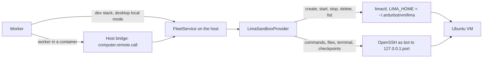

# Virtual machine computers (design)

Status: design only; nothing in the app creates or manages virtual machines yet.
The reviewed Lima template is
[`infra/sandboxes/vm/lima-computer.yaml`](../infra/sandboxes/vm/lima-computer.yaml); it passes
`limactl validate` with Lima 2.2.0 for both `vz` and `qemu`, but no VM has been booted from it. Points that still need a live run are marked **To verify** and listed in
[What is not verified yet](#what-is-not-verified-yet).

A bot on a container computer cannot build containers or start a kind cluster safely: the
container has no engine, the host engine's socket would hand over every container on that engine,
and kind needs privileged node containers, which the Kubernetes path forbids. A virtual machine per
computer moves the boundary one layer down. Builders test containers and clusters without risking
their machine. Local-first users need no hosted service. Operators get fixed resource limits, sleep
and wake, and a single place to remove what a computer left behind.

## What the owner gets

- A new computer kind, **Virtual machine** (engine and kind `vm`). Each bot computer placed on a
  virtual machine connection gets its own VM; a Team Computer is one VM shared by its bots.
- The VM is a full Ubuntu 24.04 LTS system with Docker Engine (rootless, with Buildx and Compose),
  kind and kubectl. `docker run hello-world` and `kind create cluster` work from the bot's shell.
- It runs on the owner's machine through [Lima](https://lima-vm.io/): Apple's Virtualization
  framework (`vz`) on macOS 13 or later, QEMU with KVM on Linux. Lima is installed by the owner
  (for example `brew install lima`); Ardur adds no dependency and bundles no hypervisor.
- **Windows is not offered.** Lima lists Windows hosts as untested on its
  [installation page](https://lima-vm.io/docs/installation/), and its
  [WSL2 driver](https://lima-vm.io/docs/config/vmtype/wsl2/) is experimental, needs rootfs
  archives instead of disk images, and leaves many options unsupported. The **Virtual machine**
  option is not shown when the host is Windows. A Windows owner can run a Linux VM they manage
  and add it as an SSH machine, which [Fleet](fleet.md) already supports.
- The bot is an ordinary user inside its VM, not root. It is root inside its own containers.
  [Security model](#security-model) explains why: Lima's default network lets a guest reach every
  service listening on the host's localhost, and only a firewall the bot cannot change closes that.

## Architecture



### Provider

`LimaSandboxProvider` (new, `packages/host-runtime/src/fleet/lima.ts`) extends
`LinuxFleetSandbox`, like `SshSandboxProvider`. Lifecycle calls go to `limactl`. Everything else
(commands, files, the interactive terminal, workspace export and import) goes through an internal
`SshSandboxProvider` per VM, pointed at `127.0.0.1:<sshLocalPort>` as the guest user `bot`. It
reuses Fleet's OpenSSH argv, BatchMode, strict host keys, SFTP staging, descriptor-confined file
scripts, bounded tar checkpoints and `FleetTerminal`, so none of that is written twice.

```ts
export class LimaSandboxProvider extends LinuxFleetSandbox {
  constructor(settings: VmSettings, options: {
    limaHome: string;            // ~/.ardurbot/vm/lima
    deployment: string;          // label: first 16 hex of SHA-256 of the deployment id
    processes?: FleetProcess;    // tests inject a fake limactl on PATH
    platform?: NodeJS.Platform;
  });
  describe(): SandboxDescriptor; // id and kind "vm", FLEET_LINUX_CAPABILITIES
  provision(): Promise<ComputerRef>;  // derives the name; no VM work
  prepare(): Promise<void>;           // create if missing, start if stopped, wait until ready
  stop(): Promise<void>;              // LinuxFleetSandbox.stop, then limactl stop
  destroy(): Promise<void>;           // limactl delete --force, then drop the host-key pin
  capacity(): Promise<CapacitySnapshot>;
  test(context): Promise<{ os: "Linux"; version: string; capacity: CapacitySnapshot }>;
  reconcile(instances: { name: string; active: boolean }[]): Promise<ReconcileResult>;
  remove(name: string): Promise<void>; // an unused VM, after the owner confirms
  closeAll(): Promise<void>;           // stop running VMs when the app quits
}
```

The VM name is `ardurbot-` plus the first 24 hex characters of
`fleetComputerKey(spaceId, homeKey)`, the same hash Fleet already uses for SSH homes and remote
containers. It is deterministic, so the API can compute every VM name from its computer rows
without a stored reference. The reference is `vm:<name>`; `fresh` is true when the instance did not
exist yet.

### Lima commands

Every call is an argv array through `FleetProcess` (no shell), with `LIMA_HOME` set to Ardur's own
directory and `--tty=false` so nothing prompts. `limactl` is resolved from the owner's `PATH` with
the existing `resolveHostBinary`.

| Operation | Command | Notes |
| --- | --- | --- |
| Check | `limactl --version` | Parse `limactl version X.Y.Z`; require 2.2.0 or later, the version the template was validated with. |
| Create | `limactl --tty=false create --name <name> --set .vmType="vz" --set .cpus=2 --set .memory="4GiB" --set .disk="40GiB" --set .images=[…] --set .param.ArdurComputer="…" --set .param.ArdurDeployment="…" <template>` | `<template>` is the embedded template written to a private temporary file. `.images` points at Ardur's verified local image (see [Image download](#image-download)). Values are JSON-encoded from validated settings. |
| Start and wake | `limactl --tty=false start --timeout 10m <name>` | 10 minutes is Lima's default; readiness is then checked over SSH (see below). |
| Sleep | `limactl --tty=false stop <name>` | `stop --force` if the graceful stop fails or takes more than two minutes. |
| Destroy | `limactl --tty=false delete --force <name>` | Removes the instance directory, including its disk. |
| State | `limactl --tty=false list --json` | One JSON object per line. Ardur reads `name`, `status` (`Running`, `Stopped`, `Broken`, …), `dir`, `cpus`, `memory`, `disk`, `sshLocalPort` and `param`. |
| SSH details | not `show-ssh` | `limactl show-ssh` is deprecated since Lima 0.18. Ardur builds its own OpenSSH options from `sshLocalPort` and the key path, like any SSH machine. |

`limactl start` is not trusted to mean "ready": Lima's issue
[#209](https://github.com/lima-vm/lima/issues/209), "`limactl start` should wait until all
provision scripts complete", is still open. After `start` returns, `prepare` polls over SSH as
`bot` every five seconds until `/run/ardur-ready` exists and `docker version`, `kind version` and
`kubectl version --client` succeed, for at most 14 minutes on a first boot and two minutes on a
wake. Provisioning writes `/run/ardur-ready` as its last step at every boot, and `/run/ardur-failed`
with the failing command if a step fails; `/run` starts empty at each boot. The bot user can only
log in after the first provisioning has installed its key, so a successful login is itself part of
the readiness signal.

### Ardur's Lima home

Ardur never uses the owner's `~/.lima`. It sets `LIMA_HOME=~/.ardurbot/vm/lima` for every call:

- Lima merges `$LIMA_HOME/_config/default.yaml` and `override.yaml` into every instance, and list
  settings such as `mounts` are combined rather than replaced (see the end of Lima's
  [reference template](https://github.com/lima-vm/lima/blob/v2.2.0/templates/default.yaml)). A
  dedicated home means the owner's own Lima settings can never add a mount or port forward to a
  bot's VM.
- Lima keeps `~/.lima` short because a socket path must be under 104 characters on macOS
  ([internals](https://lima-vm.io/docs/dev/internals/)). The host service's own data directory is
  under `~/Library/Application Support/…`, which is too long, so the VM home cannot live there.
  The provider refuses to create a VM when `<LIMA_HOME>/<name>/` is longer than 80 characters.
- Ardur's VMs stay out of the owner's `limactl list`. To inspect them by hand:
  `LIMA_HOME=~/.ardurbot/vm/lima limactl list`.

| Path under `~/.ardurbot/vm/` | Owner | Content |
| --- | --- | --- |
| `lima/` | Lima | Instances, and `_config/user`, the private key Lima generates for its instances. |
| `images/<image id>-<arch>.img` | Ardur | The verified Ubuntu image, shared by every VM. |
| `known_hosts/<name>` | Ardur | The VM's pinned SSH host key. |
| `tombstones/<name>` | Ardur | A destroy in progress, retried after a crash. |

Directories are created with mode 0700 and files with 0600.

### Where the calls run

| Setup | Who runs `limactl` | Path |
| --- | --- | --- |
| Dev stack (`pnpm dev`, worker on the host) | The worker | `ComputerConnections.resolve` → `localFleetService().provider()` → `LimaSandboxProvider` |
| Installed desktop app, local mode | The app's own worker, on the host | Same as the dev stack |
| Worker in a container (`ARDURBOT_HOST_BRIDGE=api`) | The host service | `RemoteFleetSandbox` → `computer.remote.call` → `HostAgent` → `FleetService.call` → `LimaSandboxProvider` |
| Server with no connected host service | Nobody | Virtual machine connections are unavailable, and **Test** says why. A container cannot run a hypervisor. |

The existing `computer.remote.call` actions (`capacity`, `test`, `provision`, `prepare`, `sleep`,
`destroy`, `exec`, `files.*`, `export`, `terminal.*`) carry VM computers unchanged. Deployment-wide
VM work gets one new operation, `computer.remote.vm`, which only the API may originate (like
`computer.remote.discover`):

```ts
z.strictObject({
  op: z.literal("computer.remote.vm"),
  action: z.discriminatedUnion("type", [
    // Start or join the verified image download; result { state, receivedBytes, totalBytes }.
    z.strictObject({ type: z.literal("image"), image: imageId }),
    // Stop VMs whose computers are not active.
    // Result { stopped: string[], unused: { name: string, diskBytes: number }[] }.
    z.strictObject({ type: z.literal("reconcile"), instances: z.array(instance).max(1000) }),
    // Remove one unused VM after the owner confirms.
    z.strictObject({ type: z.literal("remove"), name: vmName }),
  ]),
});
```

In the dev stack and local mode the API calls the same `FleetService` methods directly, as it does
for discovery.

### Contracts

```ts
// packages/contracts/src/fleet.ts
export const VmSettingsSchema = z.object({
  cpus: z.number().int().min(1).max(64).default(2),
  memoryGiB: z.number().int().min(2).max(512).default(4),
  diskGiB: z.number().int().min(20).max(2048).default(40),
  /** The image the owner agreed to download; an id from packages/contracts/src/vm-images.ts. */
  image: z.string().regex(/^[a-z0-9.-]{1,64}$/),
});
```

`ComputerConnectionSettingsSchema` gains `engine: "vm"` and `vm: VmSettingsSchema.optional()`,
required exactly when the engine is `vm`. `SandboxKind`, `FLEET_KINDS` and `ENGINE_LABELS`
(`vm: "Virtual machine"`) gain `vm`. `computerCapabilities("vm")` is not graphical and has an
interactive terminal. The upper bounds are schema limits; the host also checks the request
against its own CPUs, memory and free disk (see [Resource ceilings](#resource-ceilings-and-delete)).
Connections stay in the existing `connections` table as JSON metadata, so no migration is needed.

`packages/contracts/src/vm-images.ts` (new) is the image registry: an id such as
`ubuntu-24.04-20260705`, and per architecture the URL, SHA-256 and byte size. A test keeps its
current entry equal to the `images` in the template.

### Files and interfaces

| File | Change |
| --- | --- |
| `infra/sandboxes/vm/lima-computer.yaml` | The template (this change). |
| `packages/host-runtime/src/fleet/lima-template.ts` (new) | Embeds the template text, as `linux-scripts.ts` embeds Python, so every bundle ships it; builds the `create` argv. |
| `packages/host-runtime/src/fleet/lima.ts` (new) | `LimaSandboxProvider`, the `limactl` argv builders and the `list --json` parser. |
| `packages/host-runtime/src/fleet/vm-image.ts` (new) | The verified image download job. |
| `packages/host-runtime/src/fleet/ssh-sandbox.ts` | `SshTransportOptions` for a key file path, a per-VM known-hosts file, `HostKeyAlias` and first-connection `accept-new`. Existing SSH machines keep today's options. |
| `packages/host-runtime/src/fleet/process.ts` | A `FleetProcess` factory that takes its `PATH`, so tests can put a fake `limactl` first. |
| `packages/host-runtime/src/fleet/service.ts` | Route `engine: "vm"` to `LimaSandboxProvider`; `vm:<name>` references; the `computer.remote.vm` operation; stop VMs in `close()` when the host service quits. |
| `packages/host-runtime/src/fleet/discovery.ts` | Report Lima's presence and version so Computers can offer the option. |
| `packages/contracts/src/{fleet,computer-connections,ids,fleet-bridge,vm-images}.ts` | The contracts above. |
| `packages/adapters/src/computer-connections.ts` | Resolve `vm` connections like SSH ones: bridge or local `FleetService`. |
| `packages/adapters/src/fleet/remote-sandbox.ts`, `catalog.ts` | Kind `vm`; VM connections are their own engine family. |
| `packages/adapters/src/computer-lifecycle.ts` | Show the existing "Preparing the bot computer…" progress for `vm` as it does for Docker. |
| `apps/api/src/fleet.ts`, `apps/api/src/host-bridge.ts` | Test and details for VM connections; authorization for `computer.remote.vm`; a VM reconciler next to `reconcileFleetSecretCleanup`. |
| `apps/host-service/src/index.ts`, `apps/desktop/src/local-mode.ts` | Stop running VMs on Quit. |
| `apps/web/src/pages/fleet/FleetSettings.tsx`, `apps/mobile/components/fleet-status.tsx` | Phase 2 UI. |

## The VM definition

The template is used unchanged; per-computer values are set with `limactl create --set`, a
documented flag that edits the template with yq expressions
([`limactl create`](https://lima-vm.io/docs/reference/limactl_create/)). Every field below is
documented in Lima's reference template,
[`templates/default.yaml` at v2.2.0](https://github.com/lima-vm/lima/blob/v2.2.0/templates/default.yaml),
unless another source is named.

| Field | Value | Why |
| --- | --- | --- |
| `minimumLimaVersion` | `"2.2.0"` | Lima refuses the template on older versions. Lowering it requires validating with that version. |
| `vmType` | `vz` on macOS, `qemu` on Linux | Lima's default is `vz` on macOS 13.5 or later and `qemu` elsewhere; Ardur sets it explicitly. `vz` needs macOS 13 or later ([vz](https://lima-vm.io/docs/config/vmtype/vz/)). The type cannot change after creation ([VM types](https://lima-vm.io/docs/config/vmtype/)). |
| `images` | Ubuntu 24.04 cloud images, dated `release-20260705`, with `sha256` digests | The same entries Lima 2.2.0 ships in [`_images/ubuntu-24.04.yaml`](https://github.com/lima-vm/lima/blob/v2.2.0/templates/_images/ubuntu-24.04.yaml). Ubuntu 24.04 is on Docker's [supported list](https://docs.docker.com/engine/install/ubuntu/). At create time Ardur replaces the URL with its verified local copy and keeps the digest. |
| `cpus`, `memory`, `disk` | Defaults 2, `4GiB`, `40GiB` | Lima's defaults are min(4, host cores), min(4 GiB, half of host memory) and 100 GiB. The owner sets them per connection. The disk file is sparse, so 40 GiB is a ceiling, not an allocation. |
| `plain` | `true` | [Plain mode](https://lima-vm.io/docs/config/plain/) disables mounts, dynamic port forwarding, the built-in containerd, the guest agent, Rosetta, SSH agent forwarding and host clock synchronization; provisioning scripts and SSH keys still work. |
| `mounts` | `[]` | No host directory is shared. Lima's own default is also `[]`; the explicit value keeps it that way if plain mode is ever turned off. |
| `portForwards` | One rule: `guestIP: "0.0.0.0"`, `proto: any`, `ignore: true` | Lima forwards guest ports to the host's `127.0.0.1` by default through an internal fallback rule covering every port. The reference template documents `ignore: true` with `guestIP: 0.0.0.0` as "don't forward these ports". With plain mode on, dynamic forwarding is already off; the rule keeps it off if plain mode changes. SSH on `ssh.localPort` is the one forward Lima keeps, and it "cannot be overridden". |
| `networks` | `[]` | No `vzNAT`, `socket_vmnet` or `user-v2` network: nothing lets the host, the LAN or another VM connect to the guest. Only Lima's default [user-mode network](https://lima-vm.io/docs/config/network/user/) remains, which gives the guest outbound internet through the host. |
| `hostResolver.enabled` | `true` | DNS comes from Lima's resolver at 192.168.5.3 (the user-mode network page); the guest firewall allows only that address for DNS. |
| `ssh.localPort` | `0` | Lima picks a free port on the host's loopback, forwarded to the guest's port 22. Ardur reads it from `limactl list --json` after every start. |
| `ssh.loadDotSSHPubKeys`, `ssh.forwardAgent`, `ssh.forwardX11`, `ssh.forwardX11Trusted` | `false` | Only Lima's own generated key is authorized; the owner's `~/.ssh/*.pub` keys, SSH agent and X11 display never reach the guest. |
| `ssh.overVsock` | `false` | Keeps SSH on the loopback TCP forward that Ardur connects to. Lima uses vsock only with systemd 256 or later, which Ubuntu 24.04 does not have ([port forwarding](https://lima-vm.io/docs/config/port/)), so this changes nothing today but keeps the transport fixed. |
| `containerd.system`, `containerd.user` | `false` | Lima installs nerdctl and containerd by default; Docker's packages are used instead, as in Lima's own [`docker.yaml`](https://github.com/lima-vm/lima/blob/v2.2.0/templates/docker.yaml). |
| `propagateProxyEnv` | `false` | Otherwise Lima copies the host's proxy variables, and any credentials in them, into the guest. |
| `upgradePackages` | `false` | No upgrade at every boot. The Docker packages are held; Ubuntu's own update settings in the image are left as they are. |
| `timezone` | `""` | Keeps the image's UTC instead of copying the host's time zone. |
| `user.name`, `user.comment` | `lima`, `Lima` | Lima's admin user. Without `comment`, Lima copies the host account's full name into the guest (checked with `limactl validate --fill`). |
| `param.ArdurComputer`, `param.ArdurDeployment` | Set per VM | Labels for crash recovery and orphan cleanup; Lima reports them as `param` in `limactl list --json` ([instance fields](https://github.com/lima-vm/lima/blob/v2.2.0/pkg/limatype/lima_instance.go)). Lima rejects a param that no script uses, so provisioning writes both to `/etc/ardur-labels`. |
| `provision` | One `system` script | Runs as root at every boot, after Lima's boot scripts. It is idempotent and does the slow part once. |
| `probes` | One readiness probe | Waits for `/run/ardur-ready`, and fails at once on `/run/ardur-failed`. **To verify:** whether probes run in plain mode; the provider checks readiness over SSH either way. |

### Provisioning

The `system` script does four things.

1. **Guest firewall.** It installs `nftables` if needed, writes `/etc/nftables.conf` and enables
   `nftables.service`, so the rules load early at every later boot. The `output` chain accepts
   loopback, replies on established connections, and DNS to 192.168.5.3, then rejects:
   192.168.5.2 (the host's loopback, inside 192.168.0.0/16), the other private ranges,
   link-local, carrier-grade NAT (which covers Tailscale addresses), multicast and reserved IPv4,
   and IPv6 loopback, unique-local, link-local and multicast. The public internet stays reachable
   for image pulls.
2. **Docker, pinned and signed.** Docker's apt repository is added the way Docker documents
   ([Ubuntu install](https://docs.docker.com/engine/install/ubuntu/)), with one addition: the
   downloaded key is trusted only if its fingerprint is `9DC8 5822 9FC7 DD38 854A E2D8 8D81 803C
   0EBF CD88`. The script installs `docker-ce`, `docker-ce-cli` and `docker-ce-rootless-extras`
   `5:29.8.1-1~ubuntu.24.04~noble`, `containerd.io` `2.3.6-1~ubuntu.24.04~noble`,
   `docker-buildx-plugin` `0.37.1-1~ubuntu.24.04~noble` and `docker-compose-plugin`
   `5.5.1-1~ubuntu.24.04~noble` (all present for arm64 and amd64 in Docker's `noble` pool), then
   holds them. apt checks every package against the repository's signed index
   ([apt-secure](https://manpages.ubuntu.com/manpages/noble/man8/apt-secure.8.html)). The root
   daemon and its sockets are disabled and masked: the guest has no root-owned Docker socket.
3. **kind and kubectl, checksummed.** kind `v0.33.0` comes from its GitHub release and must match
   the SHA-256 GitHub records for the asset. kubectl `v1.37.1` comes from the Kubernetes client
   tarball on `dl.k8s.io`, which must match the SHA-512 published in the
   [1.37 changelog](https://github.com/kubernetes/kubernetes/blob/master/CHANGELOG/CHANGELOG-1.37.md).
   Both checks use `--check --strict` and stop provisioning on a mismatch. kubectl 1.37 is within
   one minor version of kind 0.33's default node, `kindest/node:v1.37.0`
   ([version skew](https://kubernetes.io/docs/tasks/tools/install-kubectl-linux/)). The script
   also applies kind's documented inotify limits
   ([known issues](https://kind.sigs.k8s.io/docs/user/known-issues/)) and loads the four iptables
   modules rootless kind needs ([rootless kind](https://kind.sigs.k8s.io/docs/user/rootless/)).
4. **The bot user.** `bot` (uid 2000) gets subordinate ids, lingering, and its own rootless Docker
   through `dockerd-rootless-setuptool.sh install`
   ([rootless mode](https://docs.docker.com/engine/security/rootless/)). Docker's deb package
   ships the AppArmor profile that Ubuntu 24.04's user-namespace restriction needs
   ([troubleshooting](https://docs.docker.com/engine/security/rootless/troubleshoot/)).
   `DOCKER_HOST` in `/etc/environment` points at the bot's socket, so the Docker CLI finds the
   daemon even though Fleet runs commands with `HOME` set to the computer home. At every boot the
   script removes `bot` from `sudo`, `admin`, `docker` and `lxd`, makes the admin home unreadable
   to it, and copies the admin user's `authorized_keys` to `bot`, so both accept only the key Lima
   generated on the host.

Nothing in the template or its params is secret: the guest can read both, and the rule is that
neither ever will be.

## Security model

### What the bot can do inside

The bot is the unprivileged user `bot`. It owns its home and the computer workspace inside it,
runs its own rootless Docker daemon, builds and runs containers (root inside them, mapped to its
own subordinate ids), creates kind clusters, and reaches the public internet. It can install
software in containers and in its home; it cannot use `apt` on the VM itself. Team bots on one
VM share this user, as they share one OS user on every computer today.

### What it cannot reach

| Target | Why not |
| --- | --- |
| Host files | No mounts: `plain: true` and `mounts: []`. |
| Services on the host's localhost | Lima's user-mode network maps 192.168.5.2 (`host.lima.internal`) to the host's loopback, and Lima documents no switch to turn that off ([user-mode network](https://lima-vm.io/docs/config/network/user/)). The root-owned guest firewall rejects it. That would otherwise expose, for example, a local model server, a development database or Ardur's own API. |
| The owner's LAN and tailnet | The firewall rejects private, link-local and carrier-grade NAT ranges. |
| Other computers | Each VM has its own user-mode network; no shared network is configured. Other computers' SSH forwards and published ports are on the host's loopback, which is blocked. |
| The host's SSH agent, X11 display, proxy credentials | Forwarding is off, and proxy variables are not copied. |
| Lima's private key | It stays in `~/.ardurbot/vm/lima/_config/user` on the host. Only its public half is in the guest. |

The bot cannot remove the firewall because it has no root: no sudo, no membership in the `docker`
group, and a rootless Docker whose containers get network privileges only inside their own
namespace. **Residual risk:** a guest kernel privilege escalation would make the bot root in the
VM and let it drop the firewall, exposing the host's loopback services. The hypervisor still keeps
host files and processes out of reach. Public addresses of the host or its network are reachable
like any other internet address.

### Why the bot is not root in the VM

Root in the VM would let the bot use `apt` freely, but root can flush any firewall inside the VM,
and Lima offers no host-side switch to hide the host's loopback. Docker and kind both support
rootless operation officially, which delivers what builders asked for: containers and clusters.
If Lima gains a documented way to hide the host's loopback, root inside the VM becomes safe to
offer; that is an [open question](#open-questions-for-the-owner).

### SSH keys and host keys

Ardur connects as `bot` to `127.0.0.1:<sshLocalPort>` with `-i <LIMA_HOME>/_config/user
-o IdentitiesOnly=yes -o IdentityAgent=none`, plus Fleet's existing options (BatchMode, no agent
forwarding, `ClearAllForwardings`). The key file is used in place; it is never copied into the
guest, a template, a param, a command argument sent to the guest, a log, or the bot's environment.

Lima's documented plain `ssh` command turns host-key checks off for localhost with
`NoHostAuthenticationForLocalhost=yes` ([SSH](https://lima-vm.io/docs/usage/ssh/)). Ardur does
not. It uses a per-VM known-hosts file,
`UserKnownHostsFile=~/.ardurbot/vm/known_hosts/<name>` with `GlobalKnownHostsFile=/dev/null` and
`HostKeyAlias=<name>`, so a port reused by another VM can never match. The first connection after
Ardur's own successful create uses `StrictHostKeyChecking=accept-new`; every later one uses `yes`
([ssh_config](https://man.openbsd.org/ssh_config.5)). That first key is trusted on first use, over
a loopback port held by the Lima process Ardur just started. Another account cannot take over a
port that process holds, and a process running as the owner could already read Lima's key. The
pin is deleted with the VM, and a create that finds a stale pin removes it.

### Resource ceilings and delete

- **Hard limits.** vCPUs, memory and disk size are fixed in the VM's configuration; the guest
  cannot exceed them.
- **Host ceiling.** Before a create or start, the provider adds the memory of Ardur's running VMs
  (from `limactl list --json`) to the requested memory and refuses above the host's total minus
  2 GiB. It refuses a create below 5 GiB of free disk plus the image size. Free memory is not used
  for this check, because macOS reports file cache as used memory.
- **Delete.** `limactl delete --force` removes the instance directory and its disk. Anything not
  in the workspace checkpoint is gone, including Docker images and kind clusters. The checkpoint
  follows the existing computer rules.

### Compared with other sandboxes

| Option | On a macOS host | Boundary | Docker and kind | Fit |
| --- | --- | --- | --- | --- |
| Lima VM (this design) | Yes, through Apple's Virtualization framework; QEMU with KVM on Linux | A separate guest kernel | Yes, rootless | Runs as the owner's own account (only the unused `socket_vmnet` networks need root-installed files, per the reference template), needs no hosted service, and ends up as a Linux machine reached over SSH, which Fleet already speaks. |
| [Sysbox](https://github.com/nestybox/sysbox) | No: Linux hosts only | User namespaces in a container, sharing the host kernel | Yes, without privileged containers | On a Mac it would itself need a Linux VM. Community-maintained on a best-effort basis. |
| [Rootless Podman in a container](https://www.redhat.com/en/blog/podman-inside-container) | Only inside a Linux VM | A container with `/dev/fuse` and SELinux labelling disabled | Podman yes; kind needs extra rootless setup | Weakens container confinement and still shares the kernel. |
| [gVisor](https://gvisor.dev/docs/tutorials/docker-in-gvisor/) | No: Linux only | A user-space kernel | Docker only with raw sockets, packet writes and Docker's iptables off; kind is not documented | Linux servers only, with a narrower Docker. |
| [Kata Containers](https://katacontainers.io/learn/) | No: Linux host and guest | A VM per pod | Through a container runtime | Needs nested virtualization on a Mac. |
| [Firecracker](https://github.com/firecracker-microvm/firecracker/blob/main/docs/getting-started.md) | No: Linux with `/dev/kvm` | A microVM | Build your own guest | A building block for a cloud follow-up, not a local Mac option. |

## Lifecycle

| Ardur | Lima and the provider |
| --- | --- |
| Add a VM connection (owner confirms the download) | Ardur downloads and verifies the image once. |
| `provision` | Derive the name; check whether the instance exists. No VM work. |
| `prepare`, first time | `create`, `start`, wait for readiness, pin the host key. |
| `prepare` after sleep | `start`, wait for readiness. |
| Sleep and idle suspend | Stop the bot's processes (as today), then `stop`. The disk persists. |
| Wake | The next `prepare` starts the VM. |
| Destroy and reset | Write a tombstone, `delete --force`, remove the pin and the tombstone. |
| Update (rebuild) | The existing flow: checkpoint, destroy, create with the current template, restore. |
| Move to another connection | The existing move flow. |

### Image download

The first VM connection needs Ubuntu 24.04's cloud image: about 600 MB (Ubuntu's listing for the
September 2026 release shows 591 MB for arm64 and 596 MB for amd64). The registry records exact
sizes. Ardur downloads it when the owner adds the connection, not when a bot first needs a VM, for
three reasons:

- the owner confirms the download explicitly, with its size, before it starts;
- Ardur knows the byte count, so Computers shows real progress and time left;
- a failed first `prepare` rolls the new computer back by destroying it, and the host bridge
  limits one operation to 15 minutes. A large download inside `prepare` would risk both.

`vm-image.ts` streams the file with Node's built-in `fetch`, hashes it while writing a private
`.part` file, compares the SHA-256 with the registry, and renames it into
`~/.ardurbot/vm/images/`. A mismatch deletes the partial file. Redirects are followed only to
Ubuntu's `cloud-images.ubuntu.com` and `cloud-images-archive.ubuntu.com`; the pinned digest, not
the transport, is what makes the file trusted. One job runs per image id, and callers join it.
At create time the template's `images` entry points at that file with the same digest, so Lima
checks it again. Later VM connections reuse the file. It is deleted when no VM connection uses its
image id; each VM keeps its own disk copy. **To verify:** that `limactl create` and `start` accept
a local image path at runtime (`limactl validate` accepts it), and how the download should honour
proxy settings.

Dated Ubuntu releases move to the archive host after a few months: the `release-20260705`
directory in the template already redirects there, and Lima's own entry is the same one. Each
Ardur release that ships VM support must therefore pin a current dated release, with digests taken
from Ubuntu's signed `SHA256SUMS`, in `vm-images.ts` and the template together; the drift test
keeps them equal. An image already downloaded keeps working after the pin moves on.

The first boot of each VM then installs Docker, kind and kubectl from the internet. That time is
not measured yet; the manual acceptance run records it.

### Capacity

A VM connection's Fleet row reports the host's capacity (`hostCapacity`, source `host`, cached for
30 seconds), because its VMs draw on the host. Free memory is shown as usual. VM connections are
their own engine family, so automatic placement never moves a computer into or out of a VM.

### Checkpoints and profile changes

Checkpoints use `LinuxFleetSandbox`'s bounded tar over SSH, with Fleet's existing limits: 64 MiB
directly, 8 MiB through the host bridge. They contain the computer workspace only. Docker images,
kind clusters and anything outside the workspace survive sleep and wake on the VM's disk, but not
a move, reset or rebuild.

Image profiles (Standard, Developer) do not apply to VMs, so Settings hides that control, as it
does for host computers. CPU, memory and disk belong to the connection, and connections are
immutable. To resize, the owner adds a VM connection with the new sizes and moves the computer
to it, which uses the existing checkpoint, destroy, create and restore flow. Resizing in place
with `limactl edit` is a possible later improvement and is not designed here.

### Crash recovery and orphans

- **Quit.** The host service and the installed app's local mode stop their running VMs when the
  app quits (graceful stop in parallel, forced after 60 seconds). A dev worker restart does not,
  so hot reload does not stop VMs.
- **A VM left running.** After a crash, the API reconciler (on host connect and every 10 minutes)
  sends every VM name it can derive from its computer rows, each marked active or not. The host
  stops running VMs whose computer is not active.
- **Orphans.** An instance in Ardur's Lima home whose name starts with `ardurbot-` and whose
  `ArdurDeployment` label matches, but which no computer row names, is stopped and reported as
  unused. Computers shows it, and the owner removes it with one confirmation. Automatic deletion
  of disks the API does not know about is deliberately not done; see the
  [open questions](#open-questions-for-the-owner). Instances without the prefix, or with another
  deployment's label (for example a dev stack beside the installed app), are never touched.
- **Interrupted destroy.** A tombstone written before `limactl delete` is retried on the next
  reconcile, so a crash mid-destroy does not leave an orphan.
- **Broken VMs.** `Broken` status fails the run with a sentence and a **Reset** action.

## UX

- **Where.** Settings → Computers → **Add computer** → connection type **Virtual machine**. The
  option is shown on macOS and Linux hosts and omitted on Windows. When Lima is installed,
  Computers also shows a discovered **Virtual machine** row with **Add**, like other discovered
  engines.
- **Fields.** Name, CPUs, Memory (GB) and Disk (GB), prefilled with 2, 4 and 40 and bounded by the
  host. No advanced section.
- **First connection.** While the image is not downloaded, one line under the fields gives its
  size. Pressing **Add** is the consent and starts the download. The new row shows progress and
  time left until the image is verified; the computer can be assigned meanwhile, and a run that
  needs it first says the download is not finished.
- **First use by a bot.** The conversation shows the existing "Preparing the bot computer…" while
  the VM is created and provisioned.
- **Mobile** shows VM rows and their capacity, without Add or removal, like other computers.

### Copy

| Where | Copy | Why it is needed | Why not remove it or reveal it later |
| --- | --- | --- | --- |
| Connection type | **Virtual machine** | Names the new kind. | The list is the only place to choose it. |
| Form fields | **CPUs**, **Memory (GB)**, **Disk (GB)** | The only decisions a VM needs, fixed at creation. | Prefilled with defaults; hiding them would hide the form's purpose. |
| Under the fields, only before the first download | **Downloads Ubuntu once (about 600 MB).** | The owner agrees to a large download before it starts. | It appears only when a download will happen, and it is the consent itself. |
| Row, during the download | **Downloading {percent}% · about {minutes} min left** | The download can take minutes, and the computer is not usable until it ends. | Shown only while downloading. |
| Row, only when some exist | **{count} unused virtual machines** with **Remove** | Their disks take space and belong to no computer. | Shown only when there are some. |
| Failures only | "Install Lima 2.2 or later on this computer, then press Test." · "Virtual machines need macOS 13 or later." · "Virtual machines need access to /dev/kvm on this computer." · "Not enough memory for another virtual machine. Put another computer to sleep, or choose less memory." · "Not enough free disk space for this virtual machine. Free up space and try again." · "The Ubuntu download is not finished. Try again when Computers shows it is ready." · "The virtual machine took too long to set up. Check the internet connection and try again." · "This virtual machine is damaged. Reset it in Settings, Computers." | Each says what happened and what to do. | Shown only after the failure. |

## Verification plan

### Offline tests

All tests are deterministic and offline. They never start a VM, a container or a network download.

A fake `limactl` lives at `packages/host-runtime/src/fleet/testdata/limactl`: a Node script that
keeps instance state in `$LIMA_HOME/.fake-state.json`, appends each argv to
`$LIMA_HOME/.fake-calls.jsonl`, supports `--version`, `create`, `start`, `stop`, `delete` and
`list --json`, can be told to fail a subcommand, and exits with an error for anything else. Tests
put its directory first on `PATH` through the `FleetProcess` factory, so the real
`resolveHostBinary` and spawn path runs. SSH uses the existing `fakeSshTransport`.

`lima-template.test.ts`

- The embedded template equals `infra/sandboxes/vm/lima-computer.yaml` byte for byte.
- The template keeps `plain: true`, `mounts: []`, the ignore rule, `networks: []`, containerd off,
  `propagateProxyEnv: false`, SSH forwarding off, `user.comment`, and no `base:`.
- Every image entry has a `sha256:` digest, both architectures are present, and they equal the
  registry's current entry.
- Provisioning pins every version, has no `curl … | sh`, checks the key fingerprint, uses
  `sha256sum --check --strict` and `sha512sum --check --strict`, holds the Docker packages and
  masks the root daemon.
- The `create` argv is exact: `vz` on macOS, `qemu` on Linux, refused on Windows; values are
  JSON-encoded; out-of-range settings are refused before any process starts.

`lima.test.ts`

- Every call has `LIMA_HOME` set to Ardur's directory and `--tty=false`, and never a shell.
- `provision` derives the name and changes nothing.
- `prepare`: missing → `create` then `start`; `Stopped` → `start`; `Running` → nothing; `Broken`
  → the reset sentence; image not downloaded → a typed error before `create`.
- Readiness retries SSH until the marker and tool checks pass, and fails with a sentence at the
  bound.
- The first connection uses `accept-new` with the per-VM file and alias; later ones use `yes`;
  destroy removes the pin; a fresh create removes a stale pin.
- SSH uses `bot@127.0.0.1`, the port from `list --json`, the key path with `IdentitiesOnly` and
  `IdentityAgent=none`, and never puts the key path in the remote command.
- Sleep revokes terminals and stops processes before `stop`, then falls back to `stop --force`.
- Destroy writes a tombstone, runs `delete --force`, clears pin and tombstone, and retries after a
  failure.
- `list --json` parsing reads one object per line, ignores unknown fields and refuses malformed
  lines.
- The memory ceiling, disk floor and path-length guard refuse with sentences before `create` or
  `start`.
- Reconcile stops inactive running VMs, reports unused ones only when prefix and label match, and
  never touches other instances; `remove` refuses names that a computer still uses.
- `closeAll` stops running VMs within its bound.
- Files, checkpoints and the terminal round-trip through the fake transport.

`vm-image.test.ts` uses a loopback HTTP server fixture: the digest is verified, a wrong digest
deletes the partial file, progress is reported, concurrent callers join one job, the disk floor
refuses, and cancellation cleans up.

Also: `ssh-sandbox.test.ts` (the new transport options, and unchanged defaults), `service.test.ts`
(routing and `vm:` references), `fleet.test.ts` in contracts (schema bounds, `vm` settings
required exactly for the `vm` engine, capabilities), `remote-sandbox.test.ts` (kind `vm`),
`sandbox-conformance.test.ts` (the Lima provider with the fake `limactl` and SSH),
`fleet-host-authorization.test.ts` (mismatched VM settings refused; `computer.remote.vm` accepted
only from the API) and `fleet-connections.test.ts` (a VM connection requires image consent).
Phase 2 adds `FleetSettings.test.tsx`, `fleet.spec.ts` for the CI screenshot, and mobile
`fleet-status.test.ts`.

### Manual acceptance on a Mac

Use a Mac with Lima 2.2 or later and nothing important running in Ardur.

1. Settings → Computers → Add computer → **Virtual machine**. Name it, keep 2 CPUs, 4 GB and 40 GB,
   read the download line and press **Add**. Watch the progress row reach ready and note the
   time. Press **Test** and check the Lima version and capacity.
2. Put a private bot on it and start a run. Note how long "Preparing the bot computer…" lasts.
3. From the bot: `docker run hello-world` succeeds. `kind create cluster` succeeds, `kubectl get
   nodes` shows the node `Ready`, and `kind delete cluster` cleans up.
4. No host files: in the guest, `ls /Users` fails, and `mount` lists no `virtiofs`, `9p` or
   `sshfs` filesystem.
5. No host port forwards: in the guest, run `python3 -m http.server 8765 --bind 0.0.0.0`; on the
   host, `curl -m 3 http://127.0.0.1:8765` fails. On the host,
   `LIMA_HOME=~/.ardurbot/vm/lima limactl list --json` shows `sshLocalPort` and `hostAgentPID`,
   and `lsof -a -p <hostAgentPID> -iTCP -sTCP:LISTEN` lists only that port.
6. No host services: on the host, run `python3 -m http.server 8766 --bind 127.0.0.1`; from the
   bot, `curl -m 3 http://192.168.5.2:8766` and `curl -m 3 http://host.lima.internal:8766` fail,
   as does `curl -m 3` to the router's LAN address. `curl -sI https://registry-1.docker.io/v2/`
   still answers.
7. No escalation: from the bot, `sudo -n true` fails, `id` shows neither `sudo` nor `docker`, and
   `nft list ruleset` is refused.
8. Sleep and wake: create a file and pull an image, sleep the computer in Settings, check that
   `LIMA_HOME=~/.ardurbot/vm/lima limactl list` shows `Stopped`, start a new run, and confirm the
   file and the image are still there.
9. Delete: remove the computer. The instance is gone from that `limactl list` and its directory
   from `~/.ardurbot/vm/lima`.
10. Quit Ardur with a VM running; it stops. Force-quit Ardur (or its host service) with a VM
    running, relaunch, and check that the reconciler stops it if its computer is not active.
11. Remove a computer while the host service is disconnected, reconnect, and check that Computers
    shows one unused virtual machine and that **Remove** deletes it.

## Implementation phases

### Phase 1: provider, lifecycle and SSH reuse, headless

A VM connection can be created through the API and used by bots; the web form waits for phase 2.

- Contracts: `fleet.ts`, `computer-connections.ts`, `ids.ts`, `fleet-bridge.ts` and the new
  `vm-images.ts`, pinned to a current dated Ubuntu release (digests from Ubuntu's signed
  `SHA256SUMS`), with the template's `images` updated to match.
- Host runtime: `lima-template.ts`, `lima.ts`, `vm-image.ts`, the fake `testdata/limactl`, and the
  changes to `ssh-sandbox.ts`, `process.ts`, `service.ts` and `discovery.ts`.
- Adapters: `computer-connections.ts`, `fleet/remote-sandbox.ts`, `fleet/catalog.ts`,
  `computer-lifecycle.ts`.
- API and host: `apps/api/src/fleet.ts`, `apps/api/src/host-bridge.ts`, the VM reconciler,
  `apps/host-service/src/index.ts` and `apps/desktop/src/local-mode.ts` for stop on Quit.
- Tests: `lima-template.test.ts`, `lima.test.ts`, `vm-image.test.ts`, and the additions to
  `ssh-sandbox.test.ts`, `service.test.ts`, contracts `fleet.test.ts`, `remote-sandbox.test.ts`,
  `sandbox-conformance.test.ts`, `fleet-host-authorization.test.ts` and
  `fleet-connections.test.ts`.
- Docs: turn this page's status into "implemented for offline verification" and add a row to
  [Fleet](fleet.md)'s target table.

### Phase 2: UI and capacity

- `apps/web/src/pages/fleet/FleetSettings.tsx` and `target-name.ts`: the connection type, fields,
  download line, progress row and unused-VM row; `FleetSettings.test.tsx`.
- `apps/web/e2e/fleet.spec.ts`: a VM form screenshot for CI, linked from the PR.
- `apps/mobile/components/fleet-status.tsx` and `apps/mobile/lib/fleet-status.test.ts`: read-only
  VM rows.
- `site/data/product.json`: add the Virtual machine computer, then `pnpm site:facts`.
- Capacity: the host's capacity on VM rows, and the VM's own CPU, memory and disk (from Fleet's
  existing Linux capacity command over SSH) in the computer's details.
- Run the manual acceptance list and fill in the measured times and sizes on this page.

### Phase 3: optional graphical desktop

Run Ardur's existing computer image inside the VM's rootless Docker, and reach its token-protected
screen gateway through a dedicated OpenSSH local forward from a private Unix socket on the host
(no TCP listener), which the existing screen proxy then uses. The VM keeps no forwarded ports and
no mounts. This needs its own design review: the forward's lifetime and authorization, and the
screen capability flags for `vm`.

### Follow-up: cloud VMs

The same shape works for a VM on a cloud provider: a provider-neutral create, start, stop, delete
and list behind an adapter, the same Ubuntu image and provisioning script (as cloud-init user
data), and the same SSH transport with a pinned host key. Vendor SDKs and credentials stay in that
adapter, as AGENTS.md requires, and nothing in the core loop depends on a cloud account.

## Open questions for the owner

1. **Root in the VM.** This design makes the bot an ordinary user with rootless Docker, because a
   root bot could reach apps listening only on the owner's machine. Recommendation: keep it
   unprivileged until Lima can hide the host's localhost.
2. **Stop VMs when Ardur quits.** Recommendation: yes, so they do not use memory unseen.
3. **Default size.** 2 CPUs, 4 GB memory and a 40 GB disk. Recommendation: keep these;
   kind's 8 GB advice is for building Kubernetes, not for running a small cluster.
4. **Unused VMs.** Ask before deleting them (recommended), or delete them automatically.
5. **Installing Lima.** Ask the owner to install Lima (recommended: no new dependency in Ardur), or
   bundle it with the desktop app.

## What is not verified yet

No VM was created, started or stopped while writing this design, so everything inside the guest is
unexecuted:

- the provisioning script as a whole, including the `nft` rules (checked only with `bash -n`;
  `nft` is not available on macOS), rootless Docker set up through `runuser`, `DOCKER_HOST` from
  `/etc/environment` in SSH sessions, rootless kind on Ubuntu 24.04, and the kubectl path inside
  the client tarball;
- Docker's key fingerprint: it comes from Docker's earlier Ubuntu instructions, and the current
  page no longer prints it. A mismatch stops provisioning rather than trusting another key;
- whether probes run in plain mode, and whether `limactl start` waits for provisioning (issue
  [#209](https://github.com/lima-vm/lima/issues/209) is open; the provider checks over SSH);
- a local image path at `create` and `start` time;
- the pinned `release-20260705` image download: its directory now redirects to Ubuntu's archive
  host, which could not be reached while checking. The digests are Lima 2.2.0's own; phase 1 pins
  a current release before shipping;
- the `limactl list --json` fields, which were read from Lima's source at v2.2.0, not from a live
  run;
- whether any vsock endpoint on the host is reachable from the guest in plain mode;
- download time, first-boot time and disk use;
- a Linux host with QEMU and KVM.

## Sources

Lima (the installed 2.2.0 templates were compared with the `v2.2.0` tag and are identical):

- [Reference template `default.yaml`](https://github.com/lima-vm/lima/blob/v2.2.0/templates/default.yaml):
  every template field, defaults, the port-forward `ignore` rule, and the merge rules for
  `_config/default.yaml` and `override.yaml`.
- [`_images/ubuntu-24.04.yaml`](https://github.com/lima-vm/lima/blob/v2.2.0/templates/_images/ubuntu-24.04.yaml)
  and [`docker.yaml`](https://github.com/lima-vm/lima/blob/v2.2.0/templates/docker.yaml).
- [Plain mode](https://lima-vm.io/docs/config/plain/),
  [port forwarding](https://lima-vm.io/docs/config/port/),
  [user-mode network](https://lima-vm.io/docs/config/network/user/),
  [network modes](https://lima-vm.io/docs/config/network/),
  [VM types](https://lima-vm.io/docs/config/vmtype/), [vz](https://lima-vm.io/docs/config/vmtype/vz/),
  [WSL2](https://lima-vm.io/docs/config/vmtype/wsl2/),
  [installation](https://lima-vm.io/docs/installation/), [SSH](https://lima-vm.io/docs/usage/ssh/),
  [internals](https://lima-vm.io/docs/dev/internals/),
  [environment variables](https://lima-vm.io/docs/config/environment-variables/) and
  [deprecated features](https://lima-vm.io/docs/releases/deprecated/).
- `limactl` [create](https://lima-vm.io/docs/reference/limactl_create/),
  [start](https://lima-vm.io/docs/reference/limactl_start/),
  [stop](https://lima-vm.io/docs/reference/limactl_stop/),
  [delete](https://lima-vm.io/docs/reference/limactl_delete/),
  [list](https://lima-vm.io/docs/reference/limactl_list/),
  [validate](https://lima-vm.io/docs/reference/limactl_validate/) and
  [show-ssh](https://lima-vm.io/docs/reference/limactl_show-ssh/).
- [Instance fields](https://github.com/lima-vm/lima/blob/v2.2.0/pkg/limatype/lima_instance.go) and
  issue [#209](https://github.com/lima-vm/lima/issues/209).

Ubuntu, Docker, kind and Kubernetes:

- [Ubuntu 24.04 cloud images, release 20260705](https://cloud-images.ubuntu.com/releases/noble/release-20260705/).
- Docker [Engine on Ubuntu](https://docs.docker.com/engine/install/ubuntu/),
  [rootless mode](https://docs.docker.com/engine/security/rootless/) and its
  [troubleshooting](https://docs.docker.com/engine/security/rootless/troubleshoot/); the package
  versions were read from Docker's `noble` pool for
  [arm64](https://download.docker.com/linux/ubuntu/dists/noble/pool/stable/arm64/) and
  [amd64](https://download.docker.com/linux/ubuntu/dists/noble/pool/stable/amd64/).
- [apt-secure](https://manpages.ubuntu.com/manpages/noble/man8/apt-secure.8.html).
- kind [quick start](https://kind.sigs.k8s.io/docs/user/quick-start/),
  [known issues](https://kind.sigs.k8s.io/docs/user/known-issues/),
  [rootless](https://kind.sigs.k8s.io/docs/user/rootless/) and the
  [v0.33.0 release](https://github.com/kubernetes-sigs/kind/releases/tag/v0.33.0); the binary
  checksums are the asset digests GitHub reports for that release.
- [Install kubectl on Linux](https://kubernetes.io/docs/tasks/tools/install-kubectl-linux/) and the
  [1.37 changelog](https://github.com/kubernetes/kubernetes/blob/master/CHANGELOG/CHANGELOG-1.37.md).

Other:

- OpenSSH [`ssh_config(5)`](https://man.openbsd.org/ssh_config.5).
- [QEMU accelerators](https://www.qemu.org/docs/master/system/introduction.html): without KVM,
  QEMU falls back to pure emulation.
- [Sysbox](https://github.com/nestybox/sysbox),
  [Podman inside a container](https://www.redhat.com/en/blog/podman-inside-container),
  [Docker in gVisor](https://gvisor.dev/docs/tutorials/docker-in-gvisor/),
  [Kata Containers](https://katacontainers.io/learn/) and
  [Firecracker](https://github.com/firecracker-microvm/firecracker/blob/main/docs/getting-started.md).
