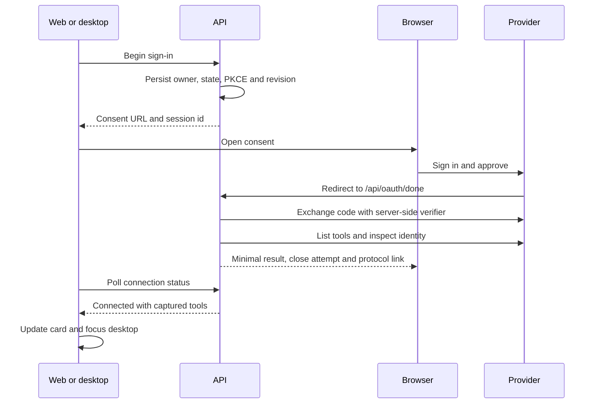

> [Source: docs/decisions/integration-lifecycle.md](https://github.com/ArdurAI/ardur-bot/blob/__ARDUR_BOT_SOURCE_REF__/docs/decisions/integration-lifecycle.md). Edit the source file, then run `python3 site/scripts/sync_docs.py` to refresh this page.

Date: 2026-09-24. Status: implemented, with offline validation and provider
prerequisites below. Live consent, packaged OS return and phone verification are
separate acceptance steps; a successful build does not prove them.

## Product reason

An operator needs sign-in to return to the current app, survive token expiry and
explain a failed connection. A builder needs visible tool permissions and bot
grants. A researcher needs current tool schemas. A team lead needs revocation to
invalidate pending approvals. A local-first user needs existing CLI sign-ins to
stay on the computer.

## Decisions and boundaries

- `/api/oauth/done` completes OAuth on the API using the persisted owner, state
  and PKCE verifier. It does not depend on browser cookies. State is single-use
  and expires after ten minutes. The page has no app shell, scrubs its query,
  forbids framing, avoids caching, broadcasts completion and attempts to close.
  Browsers can refuse to close a tab opened by the operating system; the page
  then retains a one-sentence result and **Open Ardur Bot** link.
- Web opens a popup and accepts BroadcastChannel completion or an authenticated
  connection-status poll. Desktop opens the system browser and polls the same
  status, then focuses its window. Packaged builds register `ardurbot://` and
  accept only integration routes. Development does not register the protocol.
  Cross-origin or isolated browser profiles therefore do not block completion.
- `consentStartedAt` expires stale `awaiting-consent` rows. Cancel is owner-scoped
  and acts on the current row even when an earlier session revision changed.
  Expiry rechecks revision and time under the same lock used by revoke/refresh.
- Encrypted OAuth material retains registration, metadata, tokens and PKCE.
  Refresh runs sixty seconds before expiry and once after an HTTP 401. A database
  advisory lock serializes rotating refresh tokens across API and worker
  processes. Missing refresh material, a permanent OAuth rejection, or rejection
  of the refreshed token produces **Needs sign-in** with a fixed OAuth reason
  code. Raw provider error prose is never persisted.
- Transient reads retry three times with 250/500 ms backoff. Writes are never
  replayed after an uncertain result. Network failures preserve connected state
  and credentials. A connect, Test or scheduled check captures `tools/list` and
  an optional schema-compatible identity tool. Every minute the API checks up to
  fifty granted connections whose last check is at least thirty minutes old.
  Checks do not overlap within a process. Multiple API replicas can duplicate a
  health read; token refresh remains serialized across processes.
- Health records check time, successful call time, last use, captured tool count
  and the last ten safe errors. Unchanged identity/tool definitions retain
  grants. Changed definitions or identity clear tools and pending approvals.
  Identity and workspace are shown only when a supported response provides them;
  absence is shown as unavailable, not inferred from a successful handshake.
- Allow maps read tools to the existing `allow` policy. Ask maps to `ask-first`.
  Block removes a tool from the space/bot grant. Writes always ask, preserving the
  existing approval boundary. Bot grants remain a subset of enabled space tools.
- `host-cli` records contain account identity and workspace, never tokens. Only
  the deployment owner can connect them or use them through a desktop computer.
  The host rechecks identity before a command, applies a fixed executable and
  bounded argv allowlist, and retains normal registered-folder rules. Generic
  host command execution always asks. There is no credential export, shell
  interpolation, dynamic executable, authentication command or endpoint override.
- Remote MCP and CLI paths reuse shared contracts. No runtime dependency or
  provider-specific model environment variable was added. The built-in Anthropic
  runtime still uses an API key; Claude subscriptions use the existing Claude
  Code runtime.

## Provider evidence and working options

Documentation was checked directly on the date above. Provider availability,
organization policy, app registration and existing CLI sign-in remain deployment
prerequisites. All examples and tests use fake identities.

| Integration | Connection and identity | Tools and lifecycle | Official documentation |
| --- | --- | --- | --- |
| GitHub | Host `gh auth status --active --json hosts`; active successful login and host. Remote OAuth with a registered client, or fine-grained token. | Host identity/command tools; remote advertised repository, issue and pull-request tools. OAuth refresh; token replacement on expiry; scheduled remote health. | [CLI status](https://cli.github.com/manual/gh_auth_status), [MCP host registration](https://github.com/github/github-mcp-server/blob/main/docs/host-integration.md) |
| GitLab | Host `glab auth status`; login and instance parsed from status output. Official remote OAuth at `/api/v4/mcp`. | Host commands or advertised MCP tools; remote identity only if a compatible identity tool is available. OAuth refresh and tool health. Server/group feature configuration can restrict access. | [CLI status](https://docs.gitlab.com/cli/auth/status/), [MCP server](https://docs.gitlab.com/user/model_context_protocol/mcp_server/) |
| Atlassian | OAuth at `https://mcp.atlassian.com/v2/mcp?tools=all`. Optional user identity tool. | Flat tool enumeration is required for per-tool grants; Jira and Confluence tools follow the account's access. OAuth refresh and tool health. | [Rovo MCP setup](https://support.atlassian.com/atlassian-ai-gateway/docs/get-started-with-the-atlassian-remote-mcp-server/) |
| Notion | Official remote OAuth. Self metadata from `notion-fetch`, or the compatible `notion-get-users` self operation. | Advertised search, page and other workspace tools; OAuth refresh and tool health. | [MCP connection](https://developers.notion.com/guides/mcp/get-started-with-mcp), [supported tools](https://developers.notion.com/guides/mcp/mcp-supported-tools) |
| Linear | Official remote OAuth at `https://mcp.linear.app/mcp`. Optional `get_user` identity. | Advertised issues, projects and workspace tools; OAuth refresh and tool health. | [MCP documentation](https://linear.app/docs/mcp) |
| Jenkins | Host `jenkins-cli who-am-i`, an owner-configured wrapper around the official jar and saved authentication file; authenticated user and configured server host. | Identity and bounded Jenkins commands; saved-token rotation belongs to the owner/CLI. Health runs the identity probe. | [Jenkins CLI](https://www.jenkins.io/doc/book/managing/cli/) |
| Kubernetes | Host `kubectl config current-context`; selected context, not a claim of current cluster authentication. | Identity and bounded kubectl commands; credential plugins retain their own refresh behavior. Inventory checks context; execution checks context again. | [Current context](https://kubernetes.io/docs/reference/kubectl/generated/kubectl_config/kubectl_config_current-context/), [install](https://kubernetes.io/docs/tasks/tools/) |
| AWS | Host `aws sts get-caller-identity --output json`; ARN and account for the selected profile. Remote OAuth at `https://aws-mcp.us-east-1.api.aws/mcp?oauth=initialize`. | Host commands or advertised AWS MCP tools. Remote refresh tokens rotate once and expire after up to twelve hours; eventual sign-in is required. CLI refresh belongs to its credential chain. | [Identity command](https://docs.aws.amazon.com/cli/latest/reference/sts/get-caller-identity.html), [MCP OAuth](https://docs.aws.amazon.com/agent-toolkit/latest/userguide/oauth-authentication.html) |
| Google Cloud | Host `gcloud config list account --format=json`; configured account, not proof of a live token. | Identity and bounded gcloud commands. The CLI owns credentials and refresh. The newer remote service is a separate protocol gap below. | [Config command](https://cloud.google.com/sdk/gcloud/reference/config/list), [Cloud CLI remote MCP](https://docs.cloud.google.com/sdk/use-gcloud-mcp) |
| Azure | Host `az account show --output json`; account name and subscription label. Remote OAuth to an owner-supplied Azure MCP deployment with a registered Entra client. | Host commands or the deployment's advertised tools. CLI owns local refresh; remote OAuth uses shared refresh/health. There is no universal hosted Azure MCP URL. | [Account command](https://learn.microsoft.com/en-us/cli/azure/account#az-account-show), [MCP security and remote deployment](https://learn.microsoft.com/en-us/azure/developer/azure-mcp-server/security) |

The host inventory has a thirty-second cache. GitHub, GitLab, AWS and Jenkins
identity commands can make network requests. Google Cloud configuration, Azure's
account cache and Kubernetes context do not prove endpoint health. A failed probe
is unavailable, not automatically an expired login. Host Test uses the latest
inventory; every command independently rechecks its selected account.

AWS OAuth requires the documented sign-in permissions and allows one account per
OAuth session. Its finite refresh lifetime cannot be extended by this client.
GitHub and Azure registration can be supplied through the connection's advanced
fields; secrets enter the existing encrypted store. Existing deployment-level
GitHub registration remains compatible. See [self-host secrets](/docs/self-host-secrets/).

## Parity and remaining boundaries

[Claude's connector controls](https://support.claude.com/en/articles/11176164-use-connectors-to-extend-claude-s-capabilities)
and [tool access](https://support.claude.com/en/articles/13730515-manage-claude-s-tool-access)
provide approval/block controls. This change adds the same visible permission
choices for supported reads while retaining stricter approval for writes, plus
per-bot grants and review on schema changes. It does not add organization-wide
connector administration or a permission to bypass write approval.

[Codex MCP configuration](https://developers.openai.com/codex/mcp) supports OAuth,
tool inclusion/exclusion and timeouts.
[Hermes MCP configuration](https://hermes-agent.nousresearch.com/docs/reference/mcp-config-reference)
documents OAuth/refresh, tool filters and reconnect behavior. Ardur Bot now has
server-side return, expiry, refresh, recovery, safe read retry and management.
Importing their configuration files, arbitrary tool profiles and feature-for-
feature organization settings are not part of this change.

Google's [remote authentication guidance](https://docs.cloud.google.com/mcp/set-up-authentication-mcp-servers)
requires pre-registered clients and does not support DCR or client metadata
documents. The documented Cloud CLI remote service uses MCP 2026-07-28 stateless
requests. This checkout's SDK uses the earlier initialize/session protocol.
Google Cloud is therefore offered through the working host CLI; a stateless
remote transport is not claimed to work here.

Jenkins also publishes an optional [MCP plugin](https://plugins.jenkins.io/mcp-server/)
with HTTP Basic API-token authentication. It requires installation on the Jenkins
controller and is not auto-configured by the host card. A separately configured
custom MCP connection can use the existing encrypted header mechanism. The
Jenkins CLI card does not claim to install or configure that plugin.

## Owner verification

1. Apply the migration through the deployment's normal process, start the updated
   API, worker and UI, and restart the host service to load the new inventory.
2. In desktop Integrations, reconnect Notion and approve in the system browser.
   Confirm the browser shows only the completion sentence. It attempts to close;
   if the browser blocks that, use **Open Ardur Bot** in a packaged build. Confirm
   the existing desktop window focuses and Manage shows tools.
3. Cancel an old Atlassian **Finish signing in in your browser.** row. Confirm
   Connect is immediately available. A new abandoned sign-in should show
   **Sign-in timed out.** after ten minutes, and its callback must not revive it.
4. With GitHub CLI signed in, select **Use for bots on this computer**, enable the
   command tool and grant it to a bot on This computer. Request an issue listing
   and approve the exact command. Switch CLI accounts outside the app and confirm
   another call requires reconnecting instead of using the new account silently.
5. In Manage, set a read tool to **Ask**, save the tools and grant it to a bot.
   Confirm a call requires approval. Set **Block**, save, and confirm it is absent
   from that bot. Writes must never expose an Allow choice.
6. Test a healthy connection and verify grants remain. Simulate changed tool
   definitions and verify grants need review. With a controlled OAuth fixture,
   check refresh before expiry, one retry on 401, permanent failure and recovery.
7. Repeat consent in web, including a separate browser profile and a popup-blocked
   browser. Confirm no completion path loads `/app`. Check translated mobile
   states and its web management link on a device.

## Cost and operability

Health adds at most one scheduled tool/identity read per granted connection per
thirty-minute interval per API instance, plus explicit Test/connect and bounded
retries. Host inventory probes are cached for thirty seconds while host health
is requested. Provider subscriptions, MCP credits and cloud operations can still
cost money. No infrastructure, provider app, cloud resource or customer cluster
is created or changed by this implementation or its offline tests.

## Verification contract

Run workspace checks with Expo offline if necessary, Biome write then lint,
focused Vitest including host/API/OAuth/credential boundaries, Prisma generation,
desktop and host-service builds, and web translation extraction. The migration
`20260924150000_integration_lifecycle` alters the mapped `mcp_servers` table and
backfills the timestamp of older awaiting-consent rows. Do not run desktop
Playwright as routine local verification. The web integration E2E scenario now
opens Manage and selects Ask; its CI screenshot remains a publication-time check.

### Results for this change

- Workspace checks passed with `EXPO_OFFLINE=1`; Expo's online dependency lookup
  was skipped in that mode.
- The selected 38 Vitest suites passed all 352 tests, including OAuth exchange,
  expiry, refresh rotation, 401 recovery, stale-failure fencing, host parsing and
  account checks, grants, desktop return, mobile translations and the existing
  credential-boundary suite.
- `pnpm exec biome check --write .` and `pnpm lint` passed with repository warnings
  and informational diagnostics, and no errors.
- `pnpm db:generate`, `pnpm --filter @ardurbot/desktop build` and
  `pnpm --filter @ardurbot/host-service build` passed. Windows native filesystem
  binaries were unavailable on this build host; those operations remain disabled
  in this local output. This does not verify a packaged Windows install.
- `pnpm --filter @ardurbot/web intl:extract` passed. Existing untranslated web
  messages remain; new mobile messages were added to both supported catalogs.
- No live provider consent, migration application, signed desktop package, phone
  run or CI screenshot was claimed. No commits, renames or runtime dependencies
  were added.

### Visible copy

The completion page uses “Connected to {integration}. You can close this tab and
return to Ardur Bot.”, “Could not complete sign-in.” and “Open Ardur Bot”. These
are needed when browser policy blocks automatic tab closure.

Connection states use “Connected”, “Needs sign-in”, “Sign-in timed out.”,
“Signed in on this computer as {identity}”, “Not found on this computer”,
“Needs sign-in on this computer”, “Could not check this computer.” and
“Use for bots on this computer”. The host messages distinguish an absent CLI,
a failed check and a usable existing account.

Manage reveals “Test”, “Reconnect”, “Workspace”, “Tools”, “Last checked”,
“Last successful call”, “Last used”, “Not checked”, “Not used”, “Scopes”,
“Recent errors”, “Allow”, “Ask” and “Block” only after opening the connection.
“Advanced” reveals “Client ID”, “Client secret”, “GitLab host” or “Remote MCP URL”
only where registration or a configured endpoint is relevant.

The Anthropic Models panel uses “To use your Claude subscription, choose Runs on
→ Claude Code in a bot's settings.” and “Open bot settings”. This resolves the
existing contradiction between Models and the supported external runtime.
