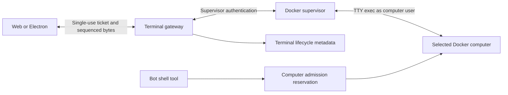

> [Source: docs/terminal/docker-terminal.md](https://github.com/ArdurAI/ardur-bot/blob/__ARDUR_BOT_SOURCE_REF__/docs/terminal/docker-terminal.md). Edit the source file, then run `python3 site/scripts/sync_docs.py` to refresh this page.

The computer overlay keeps Screen as its default. Terminal is a human shell in the selected
Docker computer. It uses the existing takeover and Release controls. Other computer providers
remain unavailable. Mobile does not load the terminal renderer.



## Ownership and data

- A short database transaction serializes command admission and human takeover for Team and
  dedicated computers. Reservations release the connection before a command executes. Their
  recovery expiry exceeds the maximum permitted bot command timeout.
- Terminal authorization checks the authenticated session, membership, selected bot and computer,
  control lease, fence, provider reference, and computer generation. Team ownership is scoped to
  the space; dedicated computer ownership also checks the user.
- A ticket expires after at most 15 seconds and can be consumed once, only by its bound Origin.
  It travels in the first WebSocket message, not a URL or log. Each reconnect requests a new ticket.
- Output is kept in memory, with 64 KiB payloads, a 256 KiB unacknowledged window and a 2 MiB replay
  buffer. The renderer acknowledges after xterm consumes a frame. Input is never replayed.
- Disconnect grace is at most 30 seconds and never exceeds the control lease. A lost history or
  process requires an explicit new session. Closing the view closes its session.
- `terminal_audit` records lifecycle metadata in sequence order. It has no columns for terminal
  input or output. P1 command records remain a separate bot execution path.

## Process cleanup

The supervisor uses Docker's TTY exec API, the container user, a fixed shell profile, a clean
environment and the selected bot's working root. An in-container subreaper adopts detached
children and terminates descendants before confirming closure. The guardian also enforces the
lease deadline independently of the supervisor process.

If the guardian dies without confirming cleanup, the supervisor stops that computer. This can
interrupt other work on a Team computer. After a supervisor restart, an orphan guardian blocks
bot command admission; revocation stops a computer whose orphaned processes cannot be recovered.
A failed cleanup retains the admission fence.

A Team computer is one operating-system trust domain. Starting in a bot folder does not isolate
that folder from other files accessible to the computer user. Host confinement remains outside
this feature.

## Renderer and dependencies

The terminal entry is a direct lazy import from `@ardurbot/ui-web/terminal`. It uses
`@xterm/xterm` 6.0.0, `@xterm/addon-fit` 0.11.0 and `@xterm/addon-search` 0.16.0, all MIT.
The web distribution retains the license at `/licenses/xterm.txt`. There are no other new runtime
dependencies. Electron keeps Node integration disabled, context isolation enabled and sandboxing
enabled; its terminal connects through the API origin.

The renderer retains 10,000 scrollback lines and consumes output bytes outside React state.
Ordinary input is UTF-8; xterm binary input preserves each byte. Clipboard, title and link escape
sequences are consumed without browser actions. Fit and search are loaded with the terminal.

## Validation and release gates

Apply the `terminal_audit` and `computer_admission` database migration before starting the updated
API and workers. Deploy the matching supervisor at the same time. Existing supervisors have no
terminal routes, so opening a terminal fails closed against an older supervisor.

After installing the pinned dependencies, build and measure:

```sh
pnpm --filter @ardurbot/web build
node scripts/terminal-bundle.mjs apps/web/dist docs/terminal/bundle-baseline.json
```

The measurement sums gzip bytes at level 9 for every initial JavaScript asset listed in the
production HTML. The terminal total includes its dependency graph and CSS, excluding assets
already in the initial load. Initial growth above 10 KiB makes the script exit unsuccessfully.
The baseline file contains either `gzipBytes` or `initial.gzipBytes`.

The offline suites cover protocol bounds, Unicode and binary data, ticket binding, cross-scope
authorization, admission races, input fencing, cleanup ordering, replay, backpressure and audit
order. The web Playwright spec captures the unavailable and active terminal surfaces for CI.
A real Docker smoke test must also verify interactive job control and descendant cleanup.
